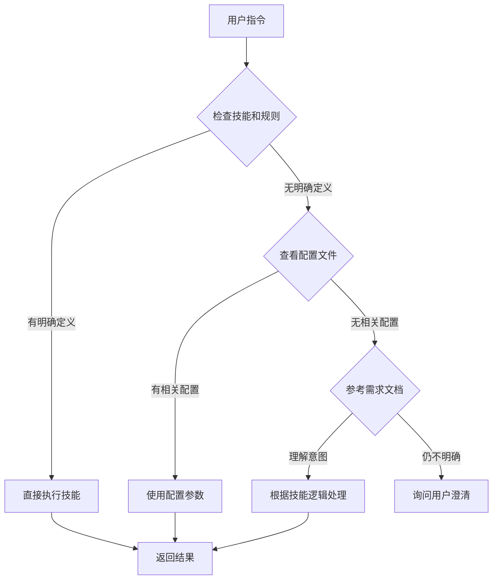

# TalkTree 文档优先级规则

## 文档层次结构

TalkTree 系统文档分为三个层次，AI 应该按以下优先级处理：

### 🥇 第一优先级：技能和规则（必须执行）

**位置**：`{AI_ROOT}/skills/talktree-*` *和* *`{AI_ROOT}/rules/talktree-*`*

**注意**：`{AI_ROOT}` 表示当前 AI 的根目录（如 `.trae/`、`.codebuddy/` 等）

**包含**：

- `{AI_ROOT}/skills/talktree-context-navigator/SKILL.md` - 上下文导航技能
- `{AI_ROOT}/skills/talktree-memory-manager/SKILL.md` - 记忆管理技能
- `{AI_ROOT}/skills/talktree-persistence/SKILL.md` - 持久化技能
- `{AI_ROOT}/rules/talktree-agent-behavior.md` - Agent 行为规范
- `{AI_ROOT}/rules/talktree-memory-inheritance.md` - 记忆继承规则
- `{AI_ROOT}/rules/talktree-persistence.md` - 持久化规则

**AI 行为**：

- ✅ **必须严格遵守**这些文件定义的行为
- ✅ **直接执行**技能文件中定义的操作
- ✅ **优先使用**规则文件中的配置和约束

### 🥈 第二优先级：项目结构和配置（参考使用）

**位置**：`{AI_ROOT}/` 根目录

**包含**：

- `{AI_ROOT}/talktree-project.md` - 项目结构说明
- `{AI_ROOT}/talktree-README.md` - 系统总览
- `{AI_ROOT}/talktree-config/config.yaml` - 配置文件

**AI 行为**：

- ✅ **参考理解**项目整体结构
- ✅ **使用配置**文件中的参数值
- ⚠️ **不覆盖**技能和规则的定义

### 🥉 第三优先级：需求规格（了解目标）

**位置**：`{AI_ROOT}/talktree-specs/`

**包含**：

- 系统核心目标
- 功能需求描述
- 验收标准
- 使用场景示例

**AI 行为**：

- ⚠️ **仅作为参考**，了解系统设计目标
- ❌ **不直接执行**需求文档中的描述
- ❌ **不覆盖**技能和规则的具体实现
- ✅ **当技能和规则不明确时**，可以参考需求文档理解意图

## AI 执行流程

当用户发出指令时，AI 应该：



## 重要说明

### ⚠️ 需求文档不是执行清单

`{AI_ROOT}/talktree-specs/需求.md` 描述的是\*\*"系统应该有什么功能"**，而不是**"现在要执行什么操作"\*\*。

**示例**：

需求文档中写：

> 系统应该支持创建话题

这**不意味着**AI 每次看到这句话都要创建话题，而是：

- 技能文件中**实现了** `tt topic new` 命令
- 规则文件中**定义了**创建话题的约束
- 当用户执行 `tt topic new "话题名"` 时，AI 才创建话题

### ✅ 技能和规则是执行依据

技能文件中的命令定义才是 AI 的执行依据：

```markdown
# skills/talktree-topic-manager/SKILL.md

## 命令定义

### tt topic new

**功能**：创建新话题

**执行步骤**：
1. 验证话题名称不重复
2. 生成唯一 ID
3. 创建话题对象
...
```

当用户执行 `tt topic new` 时，AI **按这个步骤执行**。

## 配置文件说明

如果在 `{AI_ROOT}/` 目录下也有 `talktree-specs/需求.md`：

```
{AI_ROOT}/
├── talktree-specs/
│   └── 需求.md          # 需求规格（仅供参考）
├── rules/talktree-*               # 规则（必须遵守）
└── skills/talktree-*              # 技能（直接执行）
```

**AI 应该**：

1. **首先读取** `rules/talktree-*` 和 `skills/talktree-*` 中的文件
2. **然后参考** `talktree-project.md` 和 `talktree-config/`
3. **最后了解** `talktree-specs/需求.md` 中的目标

## 版本

- **版本**: 1.0.0
- **创建日期**: 2026-03-26
- **维护者**: TalkTree Team

