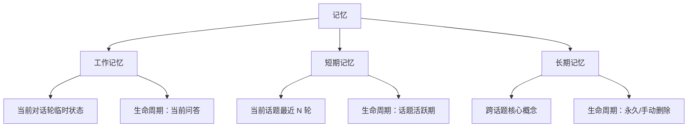
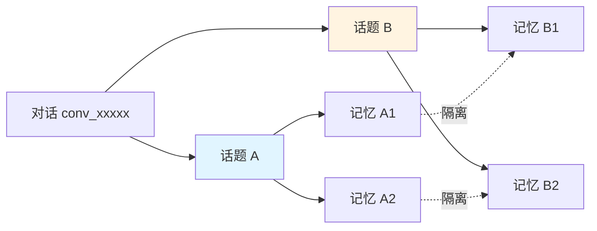
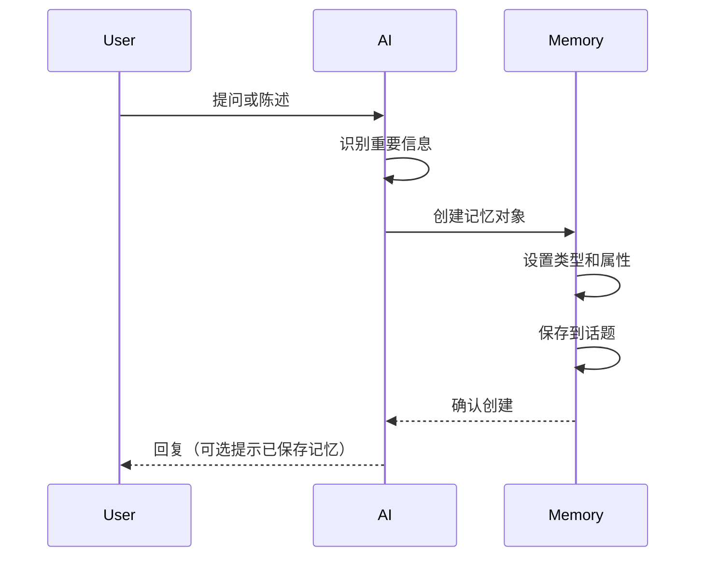
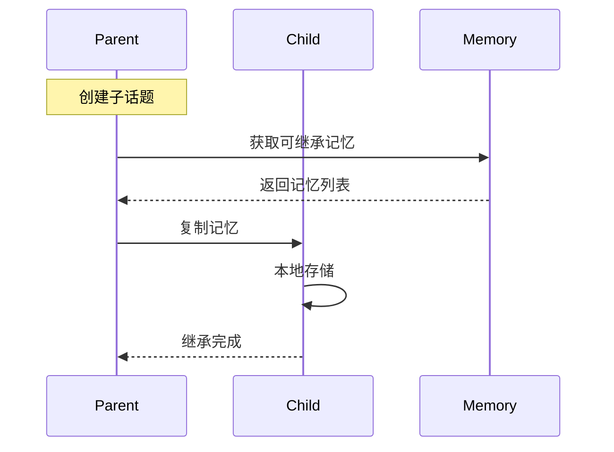
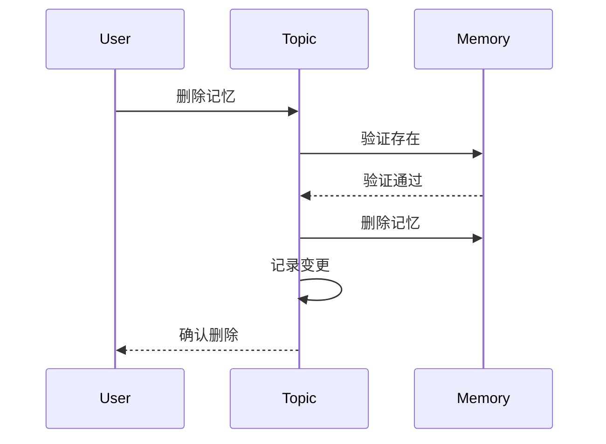

# TalkTree 记忆继承规则

## 职责范围

本规则定义记忆的分层管理、继承策略和隔离机制。

## 核心概念

### 记忆分层

TalkTree 将记忆分为三个层次：



### 记忆类型

| 类型 | 层级 | 描述 | 示例 | 继承性 |
|------|------|------|------|--------|
| `working_state` | 工作记忆 | 当前对话轮的临时状态 | 当前讨论的子话题 | ❌ 不继承 |
| `temp_context` | 工作记忆 | 临时上下文信息 | 刚提到的变量名 | ❌ 不继承 |
| `recent_qa` | 短期记忆 | 最近 N 轮问答摘要 | 最近 10 轮对话 | ❌ 不继承 |
| `core_concept` | 长期记忆 | 核心概念和定义 | 装饰器的定义 | ✅ 可继承 |
| `fact` | 长期记忆 | 事实性知识 | Python 是解释型语言 | ✅ 可继承 |
| `preference` | 长期记忆 | 用户偏好 | 喜欢简洁的代码风格 | ✅ 可继承 |
| `skill` | 长期记忆 | 技能和能力 | 会写 Python 函数 | ✅ 可继承 |

## 记忆数据结构

```python
class Memory:
    key: str                   # 记忆键
    value: Any                 # 记忆值
    type: str                  # 记忆类型
    inheritable: bool          # 是否可继承
    created_at: datetime       # 创建时间
    created_by: str            # 创建者（qa_id 或 topic_id）
    metadata: dict             # 元数据
        - source: str          # 来源（用户输入/AI 总结）
        - confidence: float    # 置信度 (0-1)
        - usage_count: int     # 使用次数
```

## 记忆继承规则

### 继承策略配置

在 `talktree-config/config.yaml` 中配置：

```yaml
memory_inheritance_strategy: "default"  # default, all, selective, none
```

### 策略详解

#### 策略 1：default（默认）

**规则**：
- ✅ 继承 `core_concept` 类型记忆
- ✅ 继承 `fact` 类型记忆
- ✅ 继承 `preference` 类型记忆
- ❌ 不继承 `working_state` 和 `temp_context`
- ❌ 不继承 `recent_qa`

**使用场景**：适合大多数学习场景，保持核心知识传承，避免临时状态干扰。

**示例**：
```
父话题 "Python 基础" 有：
- core_concept: "装饰器是增强函数功能的函数"
- fact: "Python 使用@语法表示装饰器"
- temp_context: "正在讨论@语法"

子话题 "装饰器应用" 创建后继承：
✅ "装饰器是增强函数功能的函数" (core_concept)
✅ "Python 使用@语法表示装饰器" (fact)
❌ "正在讨论@语法" (temp_context - 不继承)
```

#### 策略 2：all（全部继承）

**规则**：
- ✅ 继承所有类型的记忆
- ⚠️ 除了 `working_state`（因为它是瞬时的）

**使用场景**：适合需要完整上下文延续的场景。

#### 策略 3：selective（选择性继承）

**规则**：
- ✅ 仅继承 `inheritable=true` 的记忆
- 每个记忆可以单独设置是否可继承

**示例**：
```python
memory = Memory(
    key="decorator_definition",
    value="装饰器是...",
    type="core_concept",
    inheritable=True  # 明确标记为可继承
)
```

#### 策略 4：none（不继承）

**规则**：
- ❌ 不继承任何记忆
- 子话题从零开始

**使用场景**：适合完全独立的新话题。

## 记忆隔离规则

### 隔离级别



### 隔离规则

**规则 1：平行话题隔离**
- 同一父话题下的不同子话题，记忆完全隔离
- 话题 A 不能访问话题 B 的记忆
- 除非显式导出/导入

**规则 2：父子话题单向继承**
- 子话题可以继承父话题记忆
- 父话题不能访问子话题的记忆
- 继承是复制，不是共享

**规则 3：跨对话隔离**
- 不同对话（conv_xxxx）之间记忆完全隔离
- 除非显式导出/导入

### 隔离例外

| 场景 | 是否隔离 | 说明 |
|------|---------|------|
| 话题切换 | ✅ 隔离 | 切换后加载新话题记忆 |
| 快照恢复 | ✅ 隔离 | 恢复快照的记忆状态 |
| 记忆导出 | ❌ 不隔离 | 导出到文件，可跨话题 |
| 记忆导入 | ❌ 不隔离 | 从文件导入，可跨话题 |
| 全局记忆 | ❌ 不隔离 | 所有话题共享的全局记忆 |

## 记忆操作规则

### 规则 1：添加记忆

**触发条件**：
- AI 从对话中提取重要信息
- 用户显式添加记忆

**执行规则**：
```
1. 确定记忆类型（core_concept, fact, 等）
2. 生成记忆键（唯一标识）
3. 设置继承属性（inheritable）
4. 添加到当前话题记忆
5. 保存到文件
```

**示例**：
```
用户：什么是装饰器？
AI: 装饰器是增强函数功能的函数...
    [自动提取并保存]
    **记忆已添加**:
    - 键：decorator_definition
    - 类型：core_concept
    - 可继承：是
```

### 规则 2：删除记忆

**触发条件**：
- 用户显式删除
- 记忆过期（可选）

**执行规则**：
```
1. 验证记忆存在
2. 从当前话题删除
3. 不影响已继承的子话题（因为继承是复制）
4. 记录变更
5. 保存到文件
```

### 规则 3：更新记忆

**触发条件**：
- 用户修正记忆内容
- AI 优化记忆表述

**执行规则**：
```
1. 验证记忆存在
2. 更新记忆值
3. 更新元数据（修改时间、版本）
4. 不通知已继承的子话题（保持独立性）
5. 保存到文件
```

## 记忆查询规则

### 查询类型

**按类型查询**：
```python
# 获取所有可继承的记忆
inheritable_memories = [
    m for m in topic.memory.values() 
    if m.inheritable
]

# 获取特定类型的记忆
core_concepts = [
    m for m in topic.memory.values() 
    if m.type == "core_concept"
]
```

**按关键词查询**：
```python
# 搜索包含关键词的记忆
results = [
    m for m in topic.memory.values()
    if keyword.lower() in m.key.lower() 
    or keyword.lower() in str(m.value).lower()
]
```

### 查询输出格式

```
## 记忆列表

**话题 ID**: `{topic_id}`
**总记忆数**: {count}

### 核心概念 (3)
- **decorator_definition**: 装饰器是...
  - 类型：core_concept
  - 可继承：是
  - 创建时间：2026-03-26 14:30:00

### 事实知识 (2)
- **python_interpreted**: Python 是解释型语言
  - 类型：fact
  - 可继承：是
  - 创建时间：2026-03-26 14:35:00

### 用户偏好 (1)
- **code_style**: 喜欢简洁的代码风格
  - 类型：preference
  - 可继承：是
  - 创建时间：2026-03-26 14:40:00
```

## 记忆生命周期

### 创建



### 继承



### 删除



## 错误处理

### 错误类型

| 错误码 | 错误信息 | 解决方案 |
|--------|---------|---------|
| MEMORY_NOT_FOUND | 记忆不存在：{key} | 检查记忆键是否正确 |
| MEMORY_EXISTS | 记忆已存在：{key} | 使用不同的键或先删除 |
| INVALID_TYPE | 无效的记忆类型：{type} | 使用有效的类型（core_concept, fact 等） |
| CANNOT_INHERIT | 无法继承记忆 | 检查继承策略配置 |

### 错误响应格式

```
❌ 错误：{错误信息}

💡 建议：{解决方案}

可用命令：
- tt mem ls              # 查看所有记忆
- tt mem add <key> <value>  # 添加记忆
```

## 最佳实践

### 1. 记忆类型选择

✅ **推荐**：
- 核心概念 → `core_concept`
- 事实知识 → `fact`
- 用户偏好 → `preference`
- 临时状态 → `working_state`（不继承）

❌ **不推荐**：
- 所有记忆都用同一类型
- 临时状态设置为可继承

### 2. 记忆键命名

✅ **推荐**：
```python
decorator_definition
python_version
user_code_style_preference
```

❌ **不推荐**：
```python
mem1
temp
key123
```

### 3. 继承策略选择

| 场景 | 推荐策略 | 理由 |
|------|---------|------|
| 学习新知识 | `default` | 保持核心概念，避免干扰 |
| 项目实践 | `all` | 需要完整上下文 |
| 独立实验 | `none` | 避免旧知识干扰 |
| 精细控制 | `selective` | 手动标记每个记忆 |

## 版本

- **版本**: 1.0.0
- **创建日期**: 2026-03-26
- **维护者**: TalkTree Team
