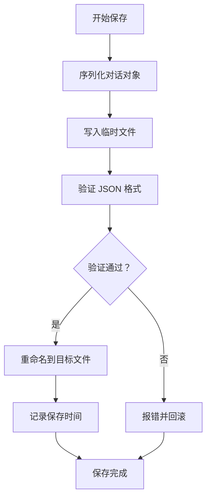

# TalkTree 持久化规则

## 职责范围

本规则定义文件存储结构、保存触发条件和历史记录生成规则。

## 核心原则

### 原则 1：自动保存

**所有状态变更都自动保存到文件**，无需用户手动操作。

### 原则 2：数据不丢失

**任何操作后都有持久化**，确保数据安全。

### 原则 3：原子操作

**关键操作要么完全成功，要么完全失败**，避免部分保存导致的数据不一致。

## 文件结构

### 目录结构

```
talktree-conversations/
└── {conversation_id}/           # 对话目录
    ├── conversation.json         # 对话主文件
    ├── changelog.json            # 变更记录
    ├── topics/                   # 话题目录
    │   ├── {topic_id}.json       # 话题文件 1
    │   ├── {topic_id}.json       # 话题文件 2
    │   └── ...
    └── history/                  # 历史记录目录
        ├── {timestamp}_history.md  # 历史记录 1
        ├── {timestamp}_history.md  # 历史记录 2
        └── ...
```

### 文件命名规范

| 文件 | 命名格式 | 示例 |
|------|---------|------|
| 对话主文件 | `conversation.json` | `conversation.json` |
| 变更记录 | `changelog.json` | `changelog.json` |
| 话题文件 | `{topic_id}.json` | `topic_550e8400.json` |
| 历史记录 | `{timestamp}_history.md` | `20260326_143022_history.md` |
| 快照文件 | `{snapshot_id}.json` | `snap_550e8400.json` |

## 数据文件格式

### conversation.json

```json
{
  "id": "conv_550e8400-e29b-41d4-a716-446655440000",
  "name": "Python Learning",
  "created_at": "2026-03-26T14:30:00Z",
  "metadata": {
    "total_topics": 5,
    "total_qa_pairs": 25,
    "total_snapshots": 3,
    "last_updated": "2026-03-26T15:45:00Z"
  },
  "topics_index": {
    "topic_xxxxx": {
      "name": "Python Basics",
      "parent_id": null,
      "file": "topics/topic_xxxxx.json"
    },
    "topic_yyyyy": {
      "name": "Decorators",
      "parent_id": "topic_xxxxx",
      "file": "topics/topic_yyyyy.json"
    }
  },
  "current_topic_id": "topic_yyyyy"
}
```

### topic_{id}.json

```json
{
  "id": "topic_550e8400-e29b-41d4-a716-446655440000",
  "name": "Decorators",
  "parent_id": "topic_xxxxx",
  "children_ids": ["topic_zzzzz"],
  "created_at": "2026-03-26T14:35:00Z",
  "metadata": {
    "qa_count": 10,
    "memory_count": 8,
    "snapshot_count": 2,
    "last_active": "2026-03-26T15:30:00Z"
  },
  "qa_pairs": [
    {
      "id": "qa_xxxxx",
      "user_input": "什么是装饰器？",
      "agent_response": "装饰器是...",
      "created_at": "2026-03-26T14:36:00Z",
      "metadata": {
        "user_input_length": 7,
        "agent_response_length": 150,
        "tokens_estimated": 200
      }
    }
  ],
  "memory": {
    "decorator_definition": {
      "key": "decorator_definition",
      "value": "装饰器是增强函数功能的函数",
      "type": "core_concept",
      "inheritable": true,
      "created_at": "2026-03-26T14:36:00Z",
      "metadata": {
        "source": "ai_summary",
        "confidence": 0.95
      }
    }
  },
  "snapshots_index": [
    {
      "id": "snap_xxxxx",
      "name": "decorator-theory-complete",
      "file": "snapshots/snap_xxxxx.json"
    }
  ]
}
```

### changelog.json

```json
{
  "conversation_id": "conv_xxxxx",
  "changes": [
    {
      "id": "change_001",
      "timestamp": "2026-03-26T14:30:00Z",
      "type": "conversation_created",
      "object_type": "conversation",
      "object_id": "conv_xxxxx",
      "details": {
        "name": "Python Learning"
      }
    },
    {
      "id": "change_002",
      "timestamp": "2026-03-26T14:35:00Z",
      "type": "topic_created",
      "object_type": "topic",
      "object_id": "topic_xxxxx",
      "details": {
        "name": "Python Basics",
        "parent_id": null
      }
    },
    {
      "id": "change_003",
      "timestamp": "2026-03-26T14:36:00Z",
      "type": "qa_pair_added",
      "object_type": "qa_pair",
      "object_id": "qa_xxxxx",
      "details": {
        "topic_id": "topic_xxxxx",
        "user_input_preview": "什么是装饰器？"
      }
    }
  ]
}
```

### 历史记录（Markdown）

```markdown
# 对话历史

**对话 ID**: `conv_xxxxx`
**对话名称**: Python Learning
**创建时间**: 2026-03-26 14:30:00
**最后更新**: 2026-03-26 15:45:22
**话题总数**: 5
**问答总数**: 25

## 话题列表

### 📁 Python Basics (ID: `topic_xxxxx`)
- **父话题**: 根话题
- **创建时间**: 2026-03-26 14:35:00
- **问答数**: 10
- **记忆数**: 8

#### 问答历史

**第 1 轮** (ID: `qa_xxxxx`)
- **用户**: 什么是装饰器？
- **AI**: 装饰器是增强函数功能的函数...
- **时间**: 2026-03-26 14:36:00

**第 2 轮** (ID: `qa_yyyyy`)
- **用户**: 能给我个例子吗？
- **AI**: 当然！下面是一个例子...
- **时间**: 2026-03-26 14:37:00

### 📁 Decorators (ID: `topic_yyyyy`)
- **父话题**: Python Basics (ID: `topic_xxxxx`)
- **创建时间**: 2026-03-26 14:40:00
- **问答数**: 15
- **记忆数**: 12

#### 问答历史

...
```

## 保存触发条件

### 立即保存

以下操作触发**立即保存**：

| 操作 | 保存内容 | 触发时机 |
|------|---------|---------|
| 创建对话 | conversation.json | 创建后 |
| 创建话题 | conversation.json + topic 文件 | 创建后 |
| 添加问答对 | topic 文件 + changelog | 添加后 |
| 切换话题 | conversation.json + changelog | 切换后 |
| 保存快照 | snapshot 文件 + topic 文件 | 保存后 |
| 删除话题 | conversation.json + changelog | 删除后 |
| 修改记忆 | topic 文件 | 修改后 |

### 定时保存

**自动保存间隔**：每 15 分钟（900 秒）

**保存内容**：
- conversation.json
- 所有话题文件
- changelog.json
- 生成历史记录 Markdown

**配置项**：
```yaml
auto_save_interval: 900           # 15 minutes
auto_save_enabled: true
generate_history_markdown: true
history_markdown_interval: 600    # 10 minutes
```

### 按需保存

用户可手动触发保存（可选功能）：

```bash
tt save now  # 立即保存
```

## 保存流程

### 保存对话主文件



### 原子操作保证

```python
def save_conversation(conv: Conversation):
    """原子保存对话"""
    
    # 1. 写入临时文件
    temp_file = f"{conv.id}.tmp"
    target_file = f"{conv.id}.json"
    
    try:
        # 2. 序列化
        data = conv.to_dict()
        
        # 3. 写入临时文件
        with open(temp_file, 'w', encoding='utf-8') as f:
            json.dump(data, f, indent=2, ensure_ascii=False)
        
        # 4. 验证 JSON 格式
        with open(temp_file, 'r', encoding='utf-8') as f:
            json.load(f)
        
        # 5. 原子重命名（覆盖）
        os.replace(temp_file, target_file)
        
        # 6. 清理临时文件（如果有）
        if os.path.exists(temp_file):
            os.remove(temp_file)
            
    except Exception as e:
        # 7. 失败回滚
        if os.path.exists(temp_file):
            os.remove(temp_file)
        raise SaveError(f"保存失败：{e}")
```

## 历史记录生成规则

### 生成时机

| 时机 | 说明 | 配置项 |
|------|------|--------|
| 每 10 轮问答 | 每添加 10 轮问答生成一次 | `history_markdown_interval: 600` |
| 切换话题时 | 切换前生成当前话题历史 | - |
| 保存快照时 | 快照保存时生成历史 | - |
| 定时保存时 | 每 15 分钟生成一次 | `auto_save_interval: 900` |

### 生成规则

```python
def generate_history_markdown(conv: Conversation, output_dir: str):
    """生成 Markdown 历史记录"""
    
    # 1. 生成文件名（带时间戳）
    timestamp = datetime.now().strftime("%Y%m%d_%H%M%S")
    filename = f"{timestamp}_history.md"
    filepath = os.path.join(output_dir, "history", filename)
    
    # 2. 生成内容
    content = []
    content.append("# 对话历史\n\n")
    content.append(f"**对话 ID**: `{conv.id}`\n")
    content.append(f"**对话名称**: {conv.name}\n")
    content.append(f"**创建时间**: {conv.created_at.strftime('%Y-%m-%d %H:%M:%S')}\n")
    content.append(f"**最后更新**: {datetime.now().strftime('%Y-%m-%d %H:%M:%S')}\n")
    content.append(f"**话题总数**: {len(conv.topics)}\n")
    content.append(f"**问答总数**: {sum(len(t.qa_pairs) for t in conv.topics.values())}\n\n")
    
    # 3. 遍历所有话题
    for topic in conv.topics.values():
        content.append(f"### 📁 {topic.name} (ID: `{topic.id}`)\n")
        content.append(f"- **父话题**: {topic.parent_id or '根话题'}\n")
        content.append(f"- **问答数**: {len(topic.qa_pairs)}\n")
        content.append(f"- **记忆数**: {len(topic.memory)}\n\n")
        
        # 4. 添加问答历史
        if topic.qa_pairs:
            content.append("#### 问答历史\n\n")
            for i, qa in enumerate(topic.qa_pairs, 1):
                content.append(f"**第 {i} 轮** (ID: `{qa.id}`)\n")
                content.append(f"- **用户**: {qa.user_input}\n")
                content.append(f"- **AI**: {qa.agent_response[:200]}...\n")
                content.append(f"- **时间**: {qa.created_at.strftime('%Y-%m-%d %H:%M:%S')}\n\n")
        
        content.append("---\n\n")
    
    # 5. 写入文件
    with open(filepath, 'w', encoding='utf-8') as f:
        f.writelines(content)
    
    return filepath
```

## 变更记录规则

### 变更类型

| 类型 | 说明 | 记录内容 |
|------|------|---------|
| `conversation_created` | 创建对话 | 对话名称 |
| `conversation_deleted` | 删除对话 | 对话 ID |
| `topic_created` | 创建话题 | 话题名称、父话题 ID |
| `topic_switched` | 切换话题 | 原话题 ID、新话题 ID |
| `topic_deleted` | 删除话题 | 话题名称、子话题数 |
| `qa_pair_added` | 添加问答 | 话题 ID、输入预览 |
| `snapshot_saved` | 保存快照 | 快照名称、问答数 |
| `snapshot_loaded` | 加载快照 | 快照名称、恢复时间 |
| `memory_added` | 添加记忆 | 记忆键、类型 |
| `memory_deleted` | 删除记忆 | 记忆键 |

### 记录格式

```python
class ChangeLog:
    def record_change(self, change_type: str, object_type: str, object_id: str, details: dict):
        """记录变更"""
        
        change = {
            "id": f"change_{len(self.changes) + 1:03d}",
            "timestamp": datetime.now().isoformat(),
            "type": change_type,
            "object_type": object_type,
            "object_id": object_id,
            "details": details
        }
        
        self.changes.append(change)
        
        # 自动保存 changelog
        self.save()
```

## 文件清理规则

### 清理策略

| 文件类型 | 清理条件 | 保留策略 |
|---------|---------|---------|
| conversation.json | 对话删除时 | 永久保留（除非删除对话） |
| topic 文件 | 话题删除时 | 永久保留（除非删除话题） |
| changelog.json | 对话删除时 | 永久保留 |
| history/*.md | 文件数 > 100 | 保留最近 100 个 |
| snapshots/*.json | 快照删除时 | 永久保留（除非删除快照） |

### 清理流程

```python
def cleanup_old_history(history_dir: str, max_files: int = 100):
    """清理旧的历史记录"""
    
    # 1. 获取所有历史文件
    files = glob.glob(os.path.join(history_dir, "*_history.md"))
    
    # 2. 按时间排序
    files.sort(key=os.path.getmtime)
    
    # 3. 删除旧文件
    while len(files) > max_files:
        old_file = files.pop(0)
        os.remove(old_file)
        log.info(f"已清理旧历史文件：{old_file}")
```

## 错误处理

### 错误类型

| 错误码 | 错误信息 | 解决方案 |
|--------|---------|---------|
| SAVE_FAILED | 保存失败：{reason} | 检查磁盘空间、文件权限 |
| FILE_NOT_FOUND | 文件不存在：{path} | 检查路径是否正确 |
| INVALID_JSON | JSON 格式无效：{path} | 检查文件内容 |
| DISK_FULL | 磁盘空间不足 | 清理磁盘空间 |

### 错误响应格式

```
❌ 错误：{错误信息}

💡 建议：{解决方案}

诊断信息：
- 文件路径：{path}
- 文件大小：{size}
- 磁盘可用空间：{free_space}
```

## 性能优化

### 优化 1：增量保存

只保存变更的部分，而不是整个文件：

```python
def incremental_save(topic: Topic, changes: dict):
    """增量保存"""
    
    # 只更新变更的字段
    topic_file = load_topic_file(topic.id)
    
    for key, value in changes.items():
        topic_file[key] = value
    
    save_topic_file(topic.id, topic_file)
```

### 优化 2：异步保存

不阻塞主线程，异步保存：

```python
async def async_save(data: dict, filepath: str):
    """异步保存"""
    
    loop = asyncio.get_event_loop()
    await loop.run_in_executor(
        None,
        lambda: json.dump(data, open(filepath, 'w'), indent=2)
    )
```

### 优化 3：批量保存

累积多个操作后批量保存：

```python
class BatchSaver:
    def __init__(self, max_batch_size: int = 10, timeout_seconds: int = 5):
        self.batch = []
        self.max_batch_size = max_batch_size
        self.timeout_seconds = timeout_seconds
    
    def add(self, operation: callable):
        self.batch.append(operation)
        
        if len(self.batch) >= self.max_batch_size:
            self.flush()
    
    def flush(self):
        """批量执行保存"""
        for op in self.batch:
            op()
        self.batch = []
```

## 版本

- **版本**: 1.0.0
- **创建日期**: 2026-03-26
- **维护者**: TalkTree Team
