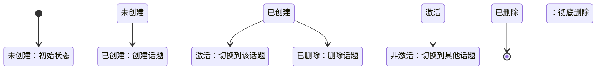
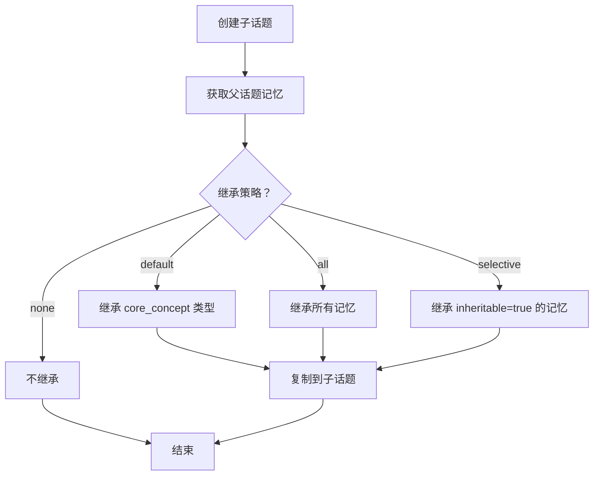

# TalkTree 话题管理规则

## 职责范围

本规则定义话题树管理的核心行为和约束。

## 核心概念

### 话题（Topic）

话题是对话的基本组织单元，具有以下特征：

- **唯一 ID**：每个话题有全局唯一的 ID（格式：`topic_{uuid}`）
- **层级结构**：支持根话题 → 子话题 → 孙话题的树状结构
- **独立性**：每个话题有独立的问答历史和记忆
- **父子关系**：子话题有且仅有一个父话题（根话题除外）

### 话题树结构

```
根话题 (topic_xxxxx)
├─ 子话题 A (topic_xxxxx)
│  ├─ 孙话题 A1 (topic_xxxxx)
│  └─ 孙话题 A2 (topic_xxxxx)
└─ 子话题 B (topic_xxxxx)
```

## 状态机

### 话题状态转换



### 状态说明

| 状态 | 描述 | 可执行操作 |
|------|------|-----------|
| 未创建 | 话题不存在 | 创建话题 |
| 已创建 | 话题已创建但未激活 | 切换、删除 |
| 激活 | 当前正在使用的话题 | 添加问答、创建子话题、保存快照 |
| 非激活 | 已创建但非当前话题 | 切换、删除 |
| 已删除 | 话题已删除 | 无 |

## 操作规则

### 规则 1：创建话题

**触发条件**：用户请求创建新话题

**前置条件**：
- 必须存在父话题（根话题除外）
- 话题名称在当前父话题下唯一

**执行规则**：
```
1. 验证话题名称不重复
2. 生成唯一 ID（topic_{uuid}）
3. 建立父子关系
4. 继承父话题记忆（根据继承策略）
5. 保存到文件
6. 返回话题信息（包含 ID）
```

**输出格式**：
```
✅ 已创建新话题：{话题名称}
**ID**: `{topic_id}`
父话题：{父话题名称} (ID: `{parent_id}`)
继承记忆：{数量} 条
创建时间：{timestamp}

💾 已自动保存到文件
```

**禁止行为**：
- ❌ 不允许创建重名话题（同一父话题下）
- ❌ 不允许向不存在的话题添加子话题

### 规则 2：切换话题

**触发条件**：用户请求切换到指定话题

**前置条件**：
- 目标话题必须存在

**执行规则**：
```
1. 保存当前话题状态
2. 验证目标话题存在
3. 加载目标话题上下文
4. 恢复目标话题状态
5. 记录状态变更
6. 返回话题信息（包含 ID）
```

**输出格式**：
```
✅ 已切换到话题：{话题名称}
**ID**: `{topic_id}`
问答数：{qa_count}
记忆数：{memory_count}

💾 已记录状态变更
```

**禁止行为**：
- ❌ 不允许切换到不存在的话题
- ❌ 切换时不允许丢失原话题状态

### 规则 3：列出话题

**触发条件**：用户请求查看所有话题

**执行规则**：
```
1. 遍历所有话题
2. 按树状结构组织
3. 标记当前激活话题
4. 显示话题及其问答对（树状图格式）
```

**输出格式**：
```
**话题列表**
📍 当前：topic_{id}: {name} | {qa_count}问答
📊 共 {count} 个话题

📁 topic_{id}: {name}
    ├── qa_{id} | {问题摘要}
    └── ... 还有 {count} 轮
```

**参数规则**：参考 [`talktree-command-rules.md`](talktree-command-rules.md) - 通用命令规则

### 规则 4：删除话题

**触发条件**：用户请求删除话题

**前置条件**：
- 话题必须存在
- 不允许删除当前激活的话题（需先切换）

**执行规则**：
```
1. 验证话题存在且非激活状态
2. 递归删除所有子话题
3. 从父话题的 children_ids 中移除
4. 从对话的 topics 索引中移除
5. 记录状态变更
6. 保存到文件
```

**禁止行为**：
- ❌ 不允许删除当前激活的话题
- ❌ 删除前不提示确认

### 规则 5：合并话题

**触发条件**：用户请求合并两个话题

**前置条件**：
- 两个话题都必须存在
- 两个话题不能有相同的 ID

**执行规则**：
```
1. 验证两个话题存在
2. 将话题 2 的问答对迁移到话题 1
3. 合并两个话题的记忆
4. 删除话题 2
5. 记录状态变更
6. 保存到文件
```

**输出格式**：
```
✅ 已合并话题
目标话题：{topic1_name} (ID: `{topic1_id}`)
源话题：{topic2_name} (ID: `{topic2_id}`)
迁移问答：{count} 条
合并记忆：{count} 条
```

## 记忆继承规则

### 继承策略

| 策略 | 描述 | 继承内容 |
|------|------|---------|
| `default` | 默认策略 | 继承核心概念（core_concept） |
| `all` | 全部继承 | 继承所有记忆 |
| `selective` | 选择性继承 | 仅继承标记为可继承的记忆 |
| `none` | 不继承 | 不继承任何记忆 |

### 继承流程



## 数据约束

### 话题数据结构

```python
class Topic:
    id: str                    # 唯一 ID (topic_{uuid})
    name: str                  # 话题名称
    parent_id: str | None      # 父话题 ID
    children_ids: list[str]    # 子话题 ID 列表
    qa_pairs: list[QAPair]     # 问答对列表
    memory: dict               # 记忆字典
    snapshots: list[Snapshot]  # 快照列表
    metadata: dict             # 元数据
        - qa_count: int
        - memory_count: int
        - snapshot_count: int
        - created_at: datetime
        - last_active: datetime
```

### 约束条件

1. **ID 唯一性**：每个话题的 ID 全局唯一
2. **名称唯一性**：同一父话题下，子话题名称唯一
3. **父子关系**：每个话题最多一个父话题
4. **无环性**：话题树不能有环
5. **根话题**：必须至少存在一个根话题（parent_id=None）

## 错误处理

### 错误类型

| 错误码 | 错误信息 | 解决方案 |
|--------|---------|---------|
| TOPIC_NOT_FOUND | 话题不存在：{name} | 检查话题名称或 ID 是否正确 |
| TOPIC_EXISTS | 话题已存在：{name} | 使用不同的话题名称 |
| CANNOT_DELETE_ACTIVE | 无法删除激活的话题 | 先切换到其他话题再删除 |
| PARENT_NOT_FOUND | 父话题不存在：{parent} | 检查父话题是否存在 |
| CANNOT_MERGE_SAME | 无法合并相同话题 | 选择不同的话题进行合并 |

### 错误响应格式

```
❌ 错误：{错误信息}

💡 建议：{解决方案}

可用命令：
- tt topic ls          # 查看所有话题
- tt topic use <name>  # 切换到话题
```

## 版本

- **版本**: 1.0.0
- **创建日期**: 2026-03-26
- **维护者**: TalkTree Team
