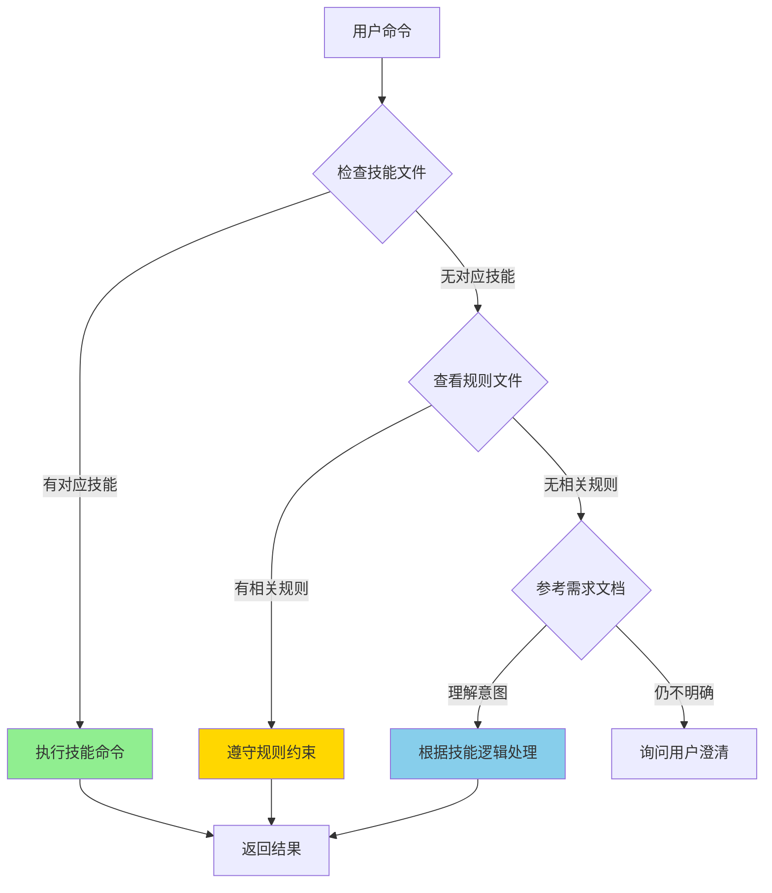

# TalkTree 项目结构

> **文档组织与 AI 执行流程**

## 文档层次结构

TalkTree 文档分为三个层次，AI 应该按优先级处理：

### 🥇 第一层：需求规格

**文件**：`talktree-specs/需求.md`

**职责**：
- 定义系统功能和验收标准
- 描述使用场景和示例
- 说明核心目标和功能需求

**AI 行为**：
- ✅ 参考理解系统设计目标
- ⚠️ 不直接执行（技能文件才是执行依据）

### 🥈 第二层：技能（AI 执行）

**文件**：`{AI_ROOT}/skills/talktree-*/SKILL.md`

**包含**：
- [`talktree-context-navigator/SKILL.md`](skills/talktree-context-navigator/SKILL.md) - 上下文导航
- [`talktree-topic-manager/SKILL.md`](skills/talktree-topic-manager/SKILL.md) - 话题管理
- [`skills/talktree-qa-manager/SKILL.md`](skills/talktree-qa-manager/SKILL.md) - 问答对管理
- [`skills/talktree-snapshot-manager/SKILL.md`](skills/talktree-snapshot-manager/SKILL.md) - 快照管理
- [`skills/talktree-memory-manager/SKILL.md`](skills/talktree-memory-manager/SKILL.md) - 记忆管理

**职责**：
- 定义命令语法和执行步骤
- 指定输出格式和响应模板
- 实现具体功能逻辑

**AI 行为**：
- ✅ **直接执行**技能定义的命令
- ✅ **严格遵守**技能规定的格式

### 🥉 第三层：规则（AI 遵守）

**文件**：`{AI_ROOT}/rules/talktree-*.md`

**包含**：
- [`rules/talktree-command-rules.md`](rules/talktree-command-rules.md) - 通用命令规则（新增）
- [`rules/talktree-agent-behavior.md`](rules/talktree-agent-behavior.md) - Agent 行为规范
- [`rules/talktree-topic-management.md`](rules/talktree-topic-management.md) - 话题管理规则
- [`rules/talktree-memory-inheritance.md`](rules/talktree-memory-inheritance.md) - 记忆继承规则
- [`rules/talktree-persistence.md`](rules/talktree-persistence.md) - 持久化规则

**职责**：
- 定义行为约束和边界
- 规定数据结构和关系
- 说明继承策略和规则

**AI 行为**：
- ✅ **严格遵守**规则定义的约束
- ✅ **参考**规则中的配置和说明

## AI 执行流程



### 执行示例

**用户**：`tt topic ls -5`

**AI 处理流程**：

1. **读取技能文件** - `talktree-context-navigator/SKILL.md`
2. **执行命令** - `tt topic ls` 命令定义
3. **遵守规则** - `talktree-command-rules.md` 参数规则
4. **解析参数** - 理解 `-5` 表示限制数量
5. **返回结果** - 显示最近 5 个话题的树状图

## 文件职责详解

| 文件 | 职责 | AI 行为 | 示例 |
|------|------|--------|------|
| `需求.md` | 定义系统功能 | 了解设计目标 | "系统应该支持创建话题" |
| `skills/*/SKILL.md` | 定义命令执行 | 直接执行 | `tt topic new` 命令步骤 |
| `rules/*.md` | 定义行为约束 | 必须遵守 | 参数规则、输出格式 |

## 配置与数据

### 配置文件

**位置**：`{AI_ROOT}/talktree-config/config.yaml`

**核心配置**：
```yaml
storage_path: "./talktree-conversations"   # 存储路径
auto_save_interval: 900                    # 自动保存间隔（秒）
memory_inheritance_strategy: "default"     # 记忆继承策略
```

### 数据存储

**位置**：`{AI_ROOT}/talktree-conversations/`

**结构**：
```
talktree-conversations/
└── conv_xxxxx/
    ├── conversation.json          # 对话主文件
    ├── changelog.json             # 变更记录
    ├── topics/
    │   ├── topic_001.json         # 话题文件
    │   └── ...
    └── history/
        ├── 20260326_143022_history.md  # 历史记录
        └── ...
```

## 命令规则速查

### ls 命令参数（git log 风格）

**所有 `ls` 命令都遵循 git log 风格**：

```bash
# 限制数量
tt topic ls -5           # 显示最近 5 个
tt topic ls -n 5         # 同上（等价形式）
tt topic ls --limit 5    # 同上（等价形式）

# 关键词过滤
tt qa ls --grep "变量"    # 搜索包含"变量"的问答
tt qa ls -g "变量"        # 同上（等价形式）

# 组合使用
tt snap ls -10 --grep "阶段"  # 最近 10 个包含"阶段"的快照
```

**详细说明**：[`talktree-command-rules.md`](rules/talktree-command-rules.md)

### 输出格式

**ls 命令** - 树状图格式：
```
**话题列表**
📍 当前：topic_{id}: {name} | {qa_count}问答
📊 共 {count} 个话题

📁 topic_{id}: {name}
    ├── qa_{id} | {问题摘要}
    └── ... 还有 {count} 轮
```

**show 命令** - 详情格式：
- 有子层级的对象（conv、topic、snap）：同 ls
- 无子层级的对象（mem、qa）：显示详细内容

## 文档维护

### 更新原则

1. **需求变更** → 更新 `需求.md`
2. **命令变更** → 更新对应 `skills/*/SKILL.md`
3. **规则变更** → 更新对应 `rules/*.md`
4. **配置变更** → 更新 `talktree-config/config.yaml`

### 一致性检查

定期执行以下检查：

- ✅ 所有 `ls` 命令参数格式一致
- ✅ 输出格式模板统一
- ✅ ID 命名规则一致
- ✅ 术语使用统一

## 快速参考

### 文件位置速查

```bash
# 需求文档
.trae/talktree-specs/需求.md

# 技能文件
.trae/skills/talktree-*/SKILL.md

# 规则文件
.trae/rules/talktree-*.md

# 配置文件
.trae/talktree-config/config.yaml
```

### 命令速查

```bash
# 话题管理
tt topic new <name> [-p <parent>]
tt topic use <name_or_id>
tt topic ls [参数]
tt topic rm <name_or_id>
tt topic merge <t1> <t2>

# 问答对管理
tt qa ls [参数]
tt qa use <qa_id>
tt qa rm <qa_id>

# 快照管理
tt snap save <name>
tt snap use <name_or_id>
tt snap ls [参数]
tt snap rm <name_or_id>

# 记忆管理
tt mem ls [参数]
tt mem add <key> <value>
tt mem rm <key>
tt mem export <file>
tt mem import <file>
```

## 版本

- **版本**: 2.0.0
- **创建日期**: 2026-03-26
- **最后更新**: 2026-03-31
- **维护者**: TalkTree Team
