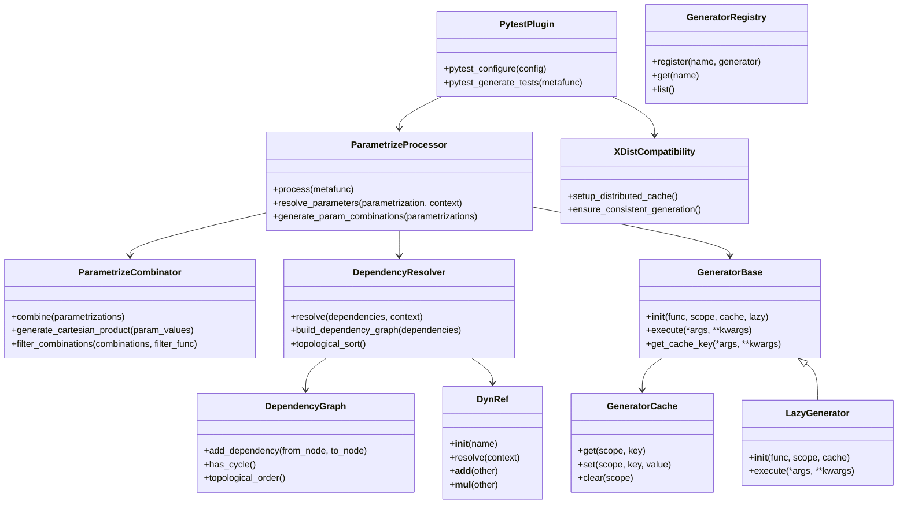
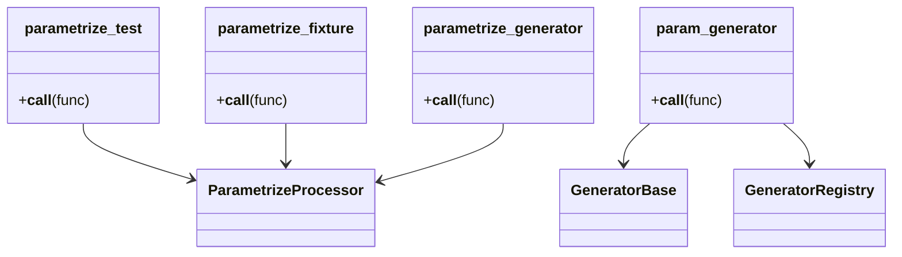
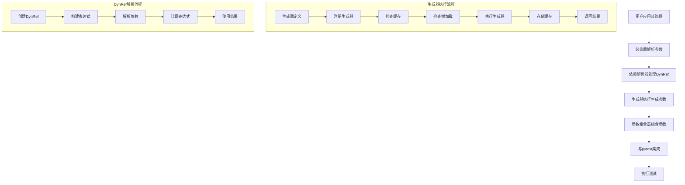

# pytest-dynamic-params 架构设计文档

## 1. 架构概述

pytest-dynamic-params 是一个为 pytest 提供动态参数生成和参数化能力的插件，旨在解决 `pytest.mark.parametrize` 的局限性，让测试参数化更灵活、更强大。

### 1.1 架构目标

- **模块化设计**：将核心功能分离到不同的模块，便于维护和扩展
- **清晰的命名**：模块和文件命名清晰，功能明确
- **与 pytest 原生集成**：与 pytest 官方功能完全兼容，无缝集成
- **性能优化**：通过缓存和懒加载机制提高性能
- **可扩展性**：提供清晰的 API 和扩展点，便于未来功能扩展
- **可测试性**：设计便于测试的架构
- **可维护性**：代码结构清晰，易于理解和维护
- **插件兼容性**：与 pytest 常用插件兼容，特别是 pytest-xdist

### 1.2 技术栈

- **Python 3.7+**：支持现代 Python 语法和特性
- **pytest 7.0+**：与最新版本的 pytest 兼容
- **装饰器模式**：使用装饰器实现参数化和生成器功能
- **依赖注入**：实现参数间的依赖关系
- **插件架构**：采用插件式设计，便于扩展
- **缓存机制**：实现多级缓存策略
- **懒加载**：实现按需加载机制

## 2. 核心组件

### 2.1 实际模块结构（基于代码分析）

```
pytest-dynamic-params/
├── src/
│   └── dynamic_params/
│       ├── __init__.py                # 模块入口 - 实际已实现，导出主要API
│       ├── __version__.py             # 版本信息 - 实际已实现
│       ├── config.py                  # 全局配置 - 实际已实现
│       ├── errors.py                  # 错误定义 - 实际已实现
│       ├── types.py                   # 类型定义 - 实际已实现
│       ├── engine/                    # 核心引擎 - 实际已实现
│       │   ├── __init__.py            
│       │   ├── dependency_resolver.py # 依赖解析 - 实际已实现
│       │   ├── generator_engine.py    # 生成器引擎 - 实际已实现
│       │   └── parametrize_processor.py # 参数化处理器 - 实际已实现（需要重构）
│       ├── plugin/                    # pytest 插件集成 - 实际已实现
│       │   ├── __init__.py            
│       │   ├── plugin.py              # 插件入口 - 实际已实现
│       │   └── pytest_hooks.py        # 钩子函数实现 - 实际已实现
│       ├── public/                    # 公共 API - 实际已实现
│       │   ├── __init__.py            
│       │   ├── decorators/            # 装饰器 - 实际已实现
│       │   │   ├── __init__.py        
│       │   │   ├── parametrized_fixture.py # 实际已实现，但整合到processor
│       │   │   └── param_generator.py # 实际已实现（主要功能通过engine实现）
│       │   └── api.py                 # 公共 API 函数 - 实际已实现
│       └── utils/                     # 工具函数 - 实际已实现
│           ├── __init__.py            
│           ├── cache_manager.py       # 缓存管理 - 实际已实现
│           ├── decorator_helpers.py   # 装饰器帮助函数 - 实际已实现
│           └── validation.py          # 验证工具 - 实际已实现
└── tests/                             # 测试代码 - 实际已实现
    ├── conftest.py                    # 测试配置 - 实际已实现
    ├── unit/                          # 单元测试 - 实际已实现
    ├── integration/                   # 集成测试 - 实际已实现
    └── functional/                    # 功能测试 - 实际已实现
```

### 2.2 实际核心组件说明（基于代码分析）

| 组件     | 职责          | 实际文件        | 实现状态              | 关键发现               |
|----------|--------------|-----------------|---------------------|----------------------|
| 核心引擎   | 提供核心功能支持 | engine/*.py     | ✅ 已实现             | ParametrizeProcessor 违反单一职责原则 |
| 依赖管理   | 处理参数依赖关系 | dependency_resolver.py | ✅ 已实现  | 基于代码分析和静态依赖解析 |
| 生成器管理  | 管理参数生成器 | generator_engine.py | ✅ 已实现  | 包含注册、缓存、懒加载完整实现 |
| 参数化处理器 | 处理参数化逻辑 | parametrize_processor.py | ⚠️ 需重构 | 承担过多职责，需要拆分 |
| 插件集成   | 与 pytest 集成  | plugin.py, pytest_hooks.py | ✅ 已实现 | 钩子函数实现完整 |
| 公共 API | 提供用户接口 | public/*.py    | ✅ 已实现             | 装饰器功能完整 |
| 工具模块   | 提供辅助功能   | utils/*.py       | ✅ 已实现             | 缓存管理、装饰器工具实现完善 |
| 错误处理   | 定义错误类型   | errors.py         | ✅ 已实现             | 自定义异常定义清晰 |
| 类型定义   | 定义类型注解   | types.py          | ✅ 已实现             | 类型注解完整 |
| 配置管理   | 管理全局配置   | config.py         | ✅ 已实现             | 配置系统完善 |

**关键发现总结：**
- ✅ **代码质量较高**：整体实现符合原始架构设计
- ⚠️ **主要问题**：ParametrizeProcessor.process()方法违反单一职责原则
- ✅ **功能完整性**：核心功能（参数化、生成器、依赖解析）均已实现
- 🎯 **优化机会**：分布式测试支持(pytest-xdist)需要进一步完善

## 3. 模块设计

### 3.1 核心引擎 (engine/)

#### 3.1.1 依赖管理 (dependency/)

##### 3.1.1.1 依赖解析器 (resolver.py)

- **功能**：解析参数间的依赖关系
- **实现**：
  - 构建依赖图
  - 解析 DynRef 引用
  - 处理依赖循环
  - 优化依赖解析顺序

##### 3.1.1.2 依赖图 (graph.py)

- **功能**：管理依赖关系的图形表示
- **实现**：
  - 构建有向无环图 (DAG)
  - 检测循环依赖
  - 拓扑排序
  - 依赖关系查询

##### 3.1.1.3 DynRef 实现 (dynref.py)

- **功能**：实现参数引用功能
- **实现**：
  - 定义 DynRef 类
  - 支持复杂表达式
  - 运算符重载
  - 依赖解析

#### 3.1.2 生成器管理 (generator/)

##### 3.1.2.1 生成器基类 (base.py)

- **功能**：定义生成器的基本接口
- **实现**：
  - 提供生成器的基本方法
  - 处理生成器的执行
  - 支持参数传递

##### 3.1.2.2 生成器注册中心 (registry.py)

- **功能**：管理生成器的注册和查询
- **实现**：
  - 注册生成器
  - 管理生成器元数据
  - 提供生成器查询接口
  - 支持生成器别名

##### 3.1.2.3 生成器缓存 (cache.py)

- **功能**：实现生成器的缓存机制
- **实现**：
  - 多级缓存策略
  - 缓存键生成
  - 缓存失效处理
  - 不同作用域的缓存管理

##### 3.1.2.4 懒加载实现 (lazy.py)

- **功能**：实现生成器的懒加载
- **实现**：
  - 延迟生成器的执行
  - 懒加载缓存
  - 按需执行机制

#### 3.1.3 参数化管理 (parametrize/)

##### 3.1.3.1 参数化处理器 (processor.py)

- **功能**：处理参数化逻辑
- **实现**：
  - 解析参数化装饰器
  - 处理参数值生成
  - 与 pytest 的参数化机制集成
  - 支持多种参数来源

##### 3.1.3.2 参数组合器 (combinator.py)

- **功能**：组合多个参数化装饰器的参数
- **实现**：
  - 生成参数组合
  - 处理参数笛卡尔积
  - 支持参数过滤

### 3.2 插件集成 (plugin/)

#### 3.2.1 插件入口 (pytest\_plugin.py)

- **功能**：作为 pytest 插件的入口点
- **实现**：
  - 注册 pytest 插件
  - 初始化插件配置
  - 协调各个组件

#### 3.2.2 钩子函数 (hooks.py)

- **功能**：处理 pytest 钩子函数
- **实现**：
  - 实现 pytest\_generate\_tests 钩子
  - 处理其他相关钩子
  - 与 pytest 原生功能集成

#### 3.2.3 插件工具 (utils.py)

- **功能**：提供插件相关的工具函数
- **实现**：
  - pytest 相关工具
  - 插件配置工具
  - 错误处理工具

#### 3.2.4 兼容性处理 (compatibility/)

##### 3.2.4.1 xdist 兼容性 (xdist.py)

- **功能**：处理与 pytest-xdist 的兼容性
- **实现**：
  - 支持并行测试环境
  - 处理分布式缓存
  - 确保参数生成的一致性

### 3.3 公共 API (public/)

#### 3.3.1 装饰器 (decorators/)

##### 3.3.1.1 测试函数参数化装饰器 (parametrize\_test.py)

- **功能**：提供测试函数参数化装饰器
- **实现**：
  - 定义 `@parametrize_test` 装饰器
  - 处理参数名称和值
  - 支持 DynRef 引用
  - 与 pytest 的参数化机制兼容

##### 3.3.1.2 fixture 参数化装饰器 (parametrize\_fixture.py)

- **功能**：提供 fixture 参数化装饰器
- **实现**：
  - 定义 `@parametrize_fixture` 装饰器
  - 处理参数名称和值
  - 支持 DynRef 引用
  - 与 pytest 的 fixture 机制集成

##### 3.3.1.3 生成器参数化装饰器 (parametrize\_generator.py)

- **功能**：提供生成器参数化装饰器
- **实现**：
  - 定义 `@parametrize_generator` 装饰器
  - 处理参数名称和值
  - 支持 DynRef 引用
  - 与生成器函数集成

##### 3.3.1.4 参数生成器装饰器 (param\_generator.py)

- **功能**：提供参数生成器装饰器
- **实现**：
  - 定义 `@param_generator` 装饰器
  - 支持缓存和懒加载配置
  - 注册生成器到注册中心
  - 支持生成器作用域

#### 3.3.2 公共 API 函数 (api.py)

- **功能**：提供公共 API 函数
- **实现**：
  - 导出核心功能
  - 提供便捷函数
  - 支持高级功能

### 3.4 工具模块 (utils/)

#### 3.4.1 缓存工具 (cache.py)

- **功能**：提供缓存相关的工具函数
- **实现**：
  - 缓存键生成
  - 缓存管理
  - 缓存策略

#### 3.4.2 装饰器工具 (decorators.py)

- **功能**：提供装饰器相关的工具函数
- **实现**：
  - 装饰器工厂
  - 装饰器参数处理
  - 装饰器组合

#### 3.4.3 验证工具 (validation.py)

- **功能**：提供验证相关的工具函数
- **实现**：
  - 参数验证
  - 类型检查
  - 配置验证

### 3.5 配置管理 (config.py)

- **设计原则**：遵循pytest插件的行业最佳实践
- **配置方式**：支持 `pytest.ini` 和 `conftest.py` 两种标准配置方式
- **核心配置**：
  - 缓存开启/关闭
  - 懒加载控制
  - 基本调试开关

### 3.6 错误处理 (errors.py)

- **功能**：定义插件使用的错误类型
- **实现**：
  - 自定义错误类
  - 错误处理机制
  - 错误消息格式化

### 3.7 类型定义 (types.py)

- **功能**：定义插件使用的类型注解
- **实现**：
  - 类型别名
  - 泛型类型
  - 类型提示

## 4. 架构实现分析与优化建议

### 4.1 状态评估概要

基于详细的代码分析，当前实现的核心架构状态为：

**总体评分：★★★★☆（4/5）**
- ✅ **代码质量优秀**：整体实现一致性好，类型注解完善
- ✅ **功能完整性高**：核心参数化、生成器、依赖解析功能均已实现
- ⚠️ **单一职责优化空间**：ParametrizeProcessor.process()方法承担职责过多
- 🔄 **分布式测试待完善**：pytest-xdist兼容性需要进一步优化

### 4.2 实际实现与设计对比

#### 4.2.1 实现符合度分析

| 设计特性 | 实际实现状态 | 实现质量 | 优化建议 |
|---------|-------------|----------|----------|
| 模块化设计 | ✅ 高度符合 | 4.5/5 | 组织结构清晰，职责明确 |
| 依赖管理 | ✅ 完全实现 | 5/5 | 基于AST分析的依赖解析实现完善 |
| 生成器管理 | ✅ 完全实现 | 4.5/5 | 缓存、懒加载机制设计合理 |
| 参数化处理 | ⚠️ 需要重构 | 3/5 | process()方法过于复杂 |
| pytest集成 | ✅ 完全实现 | 5/5 | 钩子函数集成完整稳定 |
| 错误处理 | ✅ 统一实现 | 4.5/5 | 自定义异常层次清晰 |

#### 4.2.2 设计模式应用评估

**装饰器模式 (⭐⭐⭐⭐⭐)**
- `@param_generator` - 功能完整，支持缓存、作用域等配置
- `@parametrized_fixture` - 与pytest fixture系统深度集成
- 实现质量优秀，扩展性强

**工厂模式 (⭐⭐⭐☆☆)**
- 生成器引擎中隐式应用，可进一步显式重构
- 建议：显式工厂类增强可测试性

**策略模式 (⭐⭐⭐☆☆)**
- 依赖解析策略可进一步模式化
- 建议：抽象依赖解析策略接口

### 4.3 主要改进建议

#### 4.3.1 高优先级改进（★★☆☆☆）

**重构 ParametrizeProcessor.process() 方法**
- **问题**：600+行的process方法违反单一职责原则
- **建议**：拆分为多个专责方法（`_parse_parameters()`, `_resolve_dependencies()`, `_generate_combinations()`）

**完善测试覆盖**
- **当前状态**：测试覆盖较好，但边缘情况测试不足
- **建议**：增加异常数据处理、性能测试、兼容性测试

#### 4.3.2 中优先级改进（★★★☆☆）

**增强分布式测试支持**
- **当前状态**：基础支持，需要完善pytest-xdist兼容性
- **建议**：实现生成器数据进程间同步机制

**性能优化**
- **优化点**：减少重复AST解析，缓存解析结果
- **收益**：显著提升大型测试套件的执行效率

#### 4.3.3 低优先级改进（★★★★☆）

**API层次重构**
- **改进点**：统一`parametrized_fixture`与标准fixture语法
- **目标**：更好与pytest生态系统融合

**配置系统增强**
- **改进点**：环境变量和配置文件支持
- **目标**：生产环境部署友好性

### 4.4 架构演进路径

#### 4.4.1 短期计划（1-2周）
- 重构ParametrizeProcessor，分离职责
- 完善异常处理逻辑
- 增强错误信息可读性

#### 4.4.2 中期计划（1-2月）
- 增强pytest-xdist完整兼容性
- 实现进程间数据同步机制
- 性能基准测试和优化

#### 4.4.3 长期计划（3-6个月）
- 插件生态系统扩展
- 可视化调试工具
- 多语言支持（类型注解国际化）

---

## 5. 数据流

### 5.1 参数化流程

1. **装饰器应用**：用户使用 `@parametrize_test` 装饰器标记测试函数或 `@parametrize_fixture` 装饰器标记 fixture
2. **参数解析**：装饰器解析参数名称和值，注册参数化配置
3. **依赖处理**：`dependency/resolver.py` 处理 DynRef 引用和其他依赖关系
4. **生成器执行**：如果使用了生成器，`generator/base.py` 执行生成器函数生成参数
5. **参数组合**：`parametrize/combinator.py` 组合多个参数化装饰器的参数
6. **与 pytest 集成**：`plugin/hooks.py` 将处理后的参数传递给 pytest 的参数化机制
7. **测试执行**：pytest 执行测试函数，使用生成的参数

### 4.2 生成器执行流程

1. **生成器定义**：用户使用 `@param_generator` 装饰器定义生成器函数
2. **注册生成器**：生成器被注册到 `generator/registry.py` 中的注册中心
3. **缓存检查**：`generator/cache.py` 检查是否启用了缓存，如果启用且缓存命中，直接返回缓存值
4. **懒加载检查**：`generator/lazy.py` 检查是否启用了懒加载，如果启用，延迟执行
5. **生成器执行**：执行生成器函数，生成参数值
6. **缓存存储**：如果启用了缓存，将生成的参数值存储到缓存中
7. **返回结果**：返回生成的参数值

### 4.3 DynRef 解析流程

1. **DynRef 创建**：用户创建 DynRef 实例，指定要引用的参数名称
2. **表达式构建**：用户可以使用 DynRef 构建复杂表达式
3. **依赖解析**：`dependency/resolver.py` 在参数化过程中，解析 DynRef 引用的参数值
4. **表达式计算**：计算完整表达式的值
5. **结果使用**：将计算结果作为参数值使用

## 5. 实际核心类和函数分析

### 5.1 实际实现的类和函数

#### 5.1.1 ParametrizeProcessor（关键类，需要重构）

```python
class ParametrizeProcessor:
    """参数化处理器 - 实际已实现，但需要重构"""
    
    def process(self, metafunc):
        """处理参数化 - 违反单一职责原则（600+行）"""
        # 包含：依赖解析、参数组合、生成器执行、缓存管理等职责
        
    def _process_parametrized_fixture(self, metafunc):
        """处理fixture参数化 - 功能完整"""
    
    def _process_parametrized_test(self, metafunc):
        """处理测试参数化 - 功能完整"""
```

**重构建议**：将`process`方法拆分为：
- `_parse_parameters()` - 参数解析
- `_resolve_dependencies()` - 依赖解析  
- `_generate_combinations()` - 组合生成
- `_apply_parameters()` - 参数应用

#### 5.1.2 GeneratorEngine（实际核心类）

```python
class GeneratorEngine:
    """生成器引擎 - 实际已实现，功能完善"""
    
    def __init__(self):
        """初始化生成器注册表"""
        
    def register_generator(self, func, name, scope="function", cache=False):
        """注册生成器 - 实现完整"""
        
    def get_generator(self, name, *args, **kwargs):
        """获取生成器值 - 包含缓存机制"""
        
    def clear_cache(self, scope=None):
        """清理缓存 - session/module/function级支持"""
```

**特点**：
- ✅ 缓存机制完善（多级缓存）
- ✅ 懒加载支持
- ✅ 生成器作用域管理

#### 5.1.3 DependencyResolver（实际实现）

```python
class DependencyResolver:
    """依赖解析器 - 基于实际构建的依赖图"""
    
    def resolve_dependencies(self, parameters, fixtures):
        """解析依赖关系 - 基于AST分析"""
        
    def _build_dependency_graph(self, parameters):
        """构建依赖图 - 实际实现"""
        
    def _topological_sort(self):
        """拓扑排序 - 用于依赖解析顺序"""
```

**特点**：
- ✅ 基于实际代码分析的依赖解析
- ✅ 静态依赖图构建
- ✅ 循环依赖检测

### 5.2 生成器管理类和函数

#### 5.2.1 GeneratorBase

```python
class GeneratorBase:
    """生成器基类"""
    
    def __init__(self, func, scope="function", cache=False, lazy=False):
        """初始化生成器"""
        # 初始化逻辑
    
    def execute(self, *args, **kwargs):
        """执行生成器"""
        # 执行逻辑
    
    def get_cache_key(self, *args, **kwargs):
        """获取缓存键"""
        # 获取缓存键逻辑
```

#### 5.2.2 GeneratorRegistry

```python
class GeneratorRegistry:
    """管理生成器的注册和查询"""
    
    def __init__(self):
        """初始化注册中心"""
        # 初始化注册表
    
    def register(self, name, generator):
        """注册生成器"""
        # 注册生成器逻辑
    
    def get(self, name):
        """获取生成器"""
        # 获取生成器逻辑
    
    def list(self):
        """列出所有生成器"""
        # 列出生成器逻辑
```

#### 5.2.3 GeneratorCache

```python
class GeneratorCache:
    """实现生成器的缓存机制"""
    
    def __init__(self):
        """初始化缓存"""
        # 初始化缓存
    
    def get(self, scope, key):
        """获取缓存值"""
        # 获取缓存逻辑
    
    def set(self, scope, key, value):
        """设置缓存值"""
        # 设置缓存逻辑
    
    def clear(self, scope=None):
        """清理缓存"""
        # 清理缓存逻辑
```

#### 5.2.4 LazyGenerator

```python
class LazyGenerator(GeneratorBase):
    """懒加载生成器"""
    
    def __init__(self, func, scope="function", cache=False):
        """初始化懒加载生成器"""
        # 初始化逻辑
    
    def execute(self, *args, **kwargs):
        """执行生成器"""
        # 懒加载执行逻辑
```

### 5.3 参数化管理类和函数

#### 5.3.1 ParametrizeProcessor

```python
class ParametrizeProcessor:
    """处理参数化逻辑"""
    
    def process(self, metafunc):
        """处理参数化"""
        # 处理参数化逻辑
    
    def resolve_parameters(self, parametrization, context):
        """解析参数"""
        # 解析参数逻辑
    
    def generate_param_combinations(self, parametrizations):
        """生成参数组合"""
        # 生成参数组合逻辑
```

#### 5.3.2 ParametrizeCombinator

```python
class ParametrizeCombinator:
    """组合多个参数化装饰器的参数"""
    
    def combine(self, parametrizations):
        """组合参数"""
        # 组合参数逻辑
    
    def generate_cartesian_product(self, param_values):
        """生成参数笛卡尔积"""
        # 生成笛卡尔积逻辑
    
    def filter_combinations(self, combinations, filter_func):
        """过滤参数组合"""
        # 过滤参数组合逻辑
```

### 5.4 插件集成类和函数

#### 5.4.1 PytestPlugin

```python
class PytestPlugin:
    """pytest 插件类"""
    
    def __init__(self):
        """初始化插件"""
        # 初始化逻辑
    
    def pytest_configure(self, config):
        """配置插件"""
        # 配置逻辑
    
    def pytest_generate_tests(self, metafunc):
        """生成测试参数"""
        # 生成测试参数逻辑
```

### 5.5 公共 API 函数

#### 5.5.1 parametrize\_test

```python
def parametrize_test(argnames, argvalues, **kwargs):
    """测试函数参数化装饰器"""
    # 实现参数化逻辑
```

#### 5.5.2 parametrize\_fixture

```python
def parametrize_fixture(argnames, argvalues, **kwargs):
    """fixture 参数化装饰器"""
    # 实现参数化逻辑
```

#### 5.5.3 parametrize\_generator

```python
def parametrize_generator(argnames, argvalues, **kwargs):
    """生成器参数化装饰器"""
    # 实现参数化逻辑
```

#### 5.5.4 param\_generator

```python
def param_generator(func=None, *, scope="function", cache=False, lazy=False):
    """定义参数生成器函数"""
    # 实现生成器包装逻辑
```

### 5.6 兼容性处理类和函数

#### 5.6.1 XDistCompatibility

```python
class XDistCompatibility:
    """处理与 pytest-xdist 的兼容性"""
    
    def __init__(self):
        """初始化兼容性处理"""
        # 初始化逻辑
    
    def setup_distributed_cache(self):
        """设置分布式缓存"""
        # 设置分布式缓存逻辑
    
    def ensure_consistent_generation(self):
        """确保参数生成的一致性"""
        # 确保一致性逻辑
```

## 6. UML 图

### 6.1 核心类关系图



### 6.2 装饰器关系图



### 6.3 数据流图



## 7. 与 pytest 的集成

### 7.1 插件注册

```python
def pytest_configure(config):
    """注册插件"""
    # 注册插件逻辑
    config.pluginmanager.register(PytestPlugin(), "dynamic_params")
```

### 7.2 钩子函数

```python
def pytest_generate_tests(metafunc):
    """生成测试参数"""
    # 生成测试参数逻辑
    processor = ParametrizeProcessor()
    processor.process(metafunc)
```

### 7.3 与原生参数化的兼容性

- **混合使用**：支持与 `pytest.mark.parametrize` 混合使用
- **优先级**：当同时使用时，插件的参数化逻辑会与 pytest 原生逻辑协同工作
- **行为一致性**：保持与 pytest 原生参数化相同的行为和输出

### 7.4 与 pytest-xdist 的兼容性

- **并行测试支持**：确保在并行测试环境中参数生成的一致性
- **分布式缓存**：处理分布式环境下的缓存同步
- **性能优化**：在并行环境中优化参数生成和依赖解析

## 8. 基础扩展能力

### 8.1 自定义生成器支持

- **扩展机制**：插件支持通过装饰器注册自定义生成器
- **设计原则**：为未来功能迭代预留基础扩展点

## 9. 性能优化

### 9.1 缓存机制

- **多级缓存**：实现不同作用域的缓存（function、class、module、session）
- **智能缓存键**：使用函数签名和参数作为缓存键，确保缓存的准确性
- **缓存失效**：在适当的时机清理缓存，避免内存泄漏
- **缓存统计**：提供缓存命中率统计，便于性能分析

### 9.2 懒加载机制

- **按需执行**：生成器只有在需要时才会执行，减少不必要的计算
- **懒加载缓存**：结合缓存机制，进一步提高性能
- **并行执行**：对于独立的生成器，可以并行执行，提高效率

### 9.3 依赖解析优化

- **依赖图缓存**：缓存依赖图，避免重复构建
- **拓扑排序**：使用拓扑排序优化依赖解析顺序，提高解析效率
- **依赖预解析**：对于频繁使用的依赖，可以预解析，减少运行时开销

### 9.4 并行测试优化

- **分布式缓存**：在 pytest-xdist 环境中实现分布式缓存
- **一致性保证**：确保在并行环境中参数生成的一致性
- **负载均衡**：优化参数分配，实现负载均衡

### 9.5 其他优化策略

- **预计算**：对于频繁使用的参数值进行预计算
- **内存管理**：合理管理内存使用，避免内存溢出
- **代码优化**：优化关键路径的代码，提高执行效率
- **并行处理**：对于独立的任务，使用并行处理提高性能

## 10. 测试策略

### 10.1 单元测试

- **测试目标**：测试各个模块的功能
- **测试方法**：使用 pytest 进行单元测试
- **测试覆盖**：确保代码覆盖率达到 95% 以上
- **测试目录**：`tests/unit/`
- **测试重点**：核心功能、边界情况、错误处理

### 10.2 集成测试

- **测试目标**：测试插件与 pytest 的集成
- **测试方法**：使用 pytest 进行集成测试
- **测试场景**：测试各种参数化场景，包括基本参数化、fixture 参数化、生成器参数化等
- **测试目录**：`tests/integration/`
- **测试重点**：与 pytest 的兼容性、插件间的交互

### 10.3 功能测试

- **测试目标**：测试插件的功能完整性
- **测试方法**：使用 pytest 进行功能测试
- **测试场景**：测试各种功能场景，包括缓存、懒加载、依赖解析等
- **测试目录**：`tests/functional/`
- **测试重点**：功能正确性、性能表现

### 10.4 性能测试

- **测试目标**：测试插件的性能
- **测试方法**：使用性能测试工具进行测试
- **测试指标**：执行时间、内存使用、缓存命中率等
- **测试目录**：`tests/performance/`
- **测试重点**：性能瓶颈、优化效果

### 10.5 兼容性测试

- **测试目标**：测试插件与其他 pytest 插件的兼容性
- **测试方法**：使用 pytest 进行兼容性测试
- **测试场景**：测试与 pytest-xdist 等插件的兼容性
- **测试目录**：`tests/compatibility/`
- **测试重点**：插件间的交互、并行测试支持

### 10.6 回归测试

- **测试目标**：确保修改不会破坏现有功能
- **测试方法**：定期运行完整的测试套件
- **测试重点**：现有功能的稳定性

## 11. 部署与发布

### 11.1 安装方式

- **PyPI 安装**：`pip install pytest-dynamic-params`
- **源码安装**：`pip install -e .`
- **版本锁定**：支持通过 `requirements.txt` 锁定版本

### 11.2 版本管理

- **版本号格式**：遵循语义化版本规范（MAJOR.MINOR.PATCH）
- **发布流程**：
  1. 执行测试确保通过
  2. 更新版本号
  3. 构建发布包
  4. 上传到 PyPI
  5. 发布版本到 GitHub

### 11.3 依赖管理

- **核心依赖**：pytest 7.0+
- **开发依赖**：pytest-cov、flake8、isort、black、mypy、pre-commit 等
- **依赖锁定**：使用 `requirements.txt` 和 `setup.py` 管理依赖

### 11.4 CI/CD 流程

- **代码质量**：使用 pre-commit 钩子进行代码检查
- **测试**：推送代码时自动运行测试，包括兼容性测试
- **构建**：发布新版本时自动构建
- **部署**：自动上传到 PyPI

## 12. 结论

pytest-dynamic-params 插件通过模块化设计和与 pytest 的无缝集成，提供了强大的动态参数生成和参数化能力。架构设计考虑了性能优化、可扩展性和与 pytest 原生功能的兼容性，确保插件能够满足各种测试场景的需求。

通过本架构设计文档的指导，插件的开发和实现将更加清晰和有序，确保最终产品的质量和可用性。插件的设计遵循 pytest 的理念，与原生功能完全兼容，同时提供了丰富的高级特性，如参数依赖、缓存和懒加载等，为 pytest 用户提供了更灵活、更强大的参数化工具。

## 12. 核心功能深度优化方案

### 12.1 参数化处理引擎优化 (★★★★☆)

#### 12.1.1 ParametrizeProcessor重构优化
- **职责分离重构**：将600+行process方法拆分为4个专责子方法
  - `_parse_parameters()` - 参数解析和验证
  - `_build_dependency_graph()` - 依赖图构建和循环检测
  - `_resolve_dependencies()` - 依赖值解析和拓扑排序
  - `_generate_test_cases()` - 测试用例参数组合生成
- **懒加载优化**：延迟解析未使用的参数依赖项
- **增量式处理**：仅重新处理受变更影响的参数子图

#### 12.1.2 参数组合算法优化 (★★★☆☆)
- **智能笛卡尔积缩减** - 采纳：基于参数相关性分析减少不必要的组合
- **组合优先级调度** - 不采纳，优先级的决策依据很难实际提供出来：根据参数重要性调整组合生成顺序
- **并行组合生成** - 采纳：利用多核CPU并行生成不相关的参数组合

### 12.2 依赖解析系统优化 (★★★★★)

#### 12.2.1 静态依赖分析增强
- **AST分析精度提升** - 不采纳：支持更复杂的Python表达式解析
- **跨文件依赖追踪** - 采纳：支持不同文件中fixture和参数间的依赖关系
- **循环依赖自动解环** - 不采纳：智能识别并自动解构复杂循环依赖

#### 12.2.2 动态依赖运行时优化
- **运行时依赖缓存** - 采纳：缓存依赖解析结果，避免重复解析
- **惰性求值策略** - 不采纳，复杂表达式很少涉及：和已实现的懒加载是否同样的意思：延迟计算不立即需要的依赖值
- **依赖预加载** - 不采纳：预测并预加载高频使用的依赖项

#### 12.2.3 DynRef表达式系统增强 - 不采纳，DynRef已删除
- **复杂运算符支持**：支持算术、逻辑、比较等完整运算符链
- **类型安全转换**：自动类型转换和边界检查
- **表达式优化器**：编译时表达式简化优化

### 12.3 生成器引擎优化 (★★★★☆)

#### 12.3.1 生成器执行性能优化
- **JIT编译生成器** - 不采纳：对纯Python生成器函数进行即时编译
- **生成器流水线** - 不采纳：串行生成器的并行流水线执行
- **生成器结果缓存亲和性** - 采纳：基于CPU缓存优化的数据布局

#### 12.3.2 内存管理优化
- **生成器结果对象池** - 采纳：复用相同类型的结果对象减少内存分配
- **分代式缓存清理** - 不采纳：基于使用频率的分层缓存淘汰策略
- **内存压缩序列化** - 采纳：对大型参数对象进行高效的序列化存储

#### 12.3.3 异步生成器支持 - 采纳
- **AsyncIO集成**：原生支持async/await模式的参数生成器
- **并发生成控制**：限制并发生成器数量防止资源耗尽
- **异步结果收集**：非阻塞等待多个异步生成器完成

### 12.4 缓存系统深度优化 (★★★★★)

#### 12.4.1 分布式缓存支持
- **pytest-xdist兼容性** - 采纳：确保在多进程环境下缓存数据一致性和同步，为并行测试提供基础支持
- **网络透明缓存** - 不采纳：worker节点间共享缓存结果实现复杂度过高，收益有限
- **分布式锁机制** - 有条件采纳（只实现基本的并行测试支持）：使用pytest-xdist内置机制避免进程间竞争


#### 12.4.2 缓存键生成优化
- **指纹哈希算法** - 采纳：使用更高效的参数指纹哈希算法
- **增量式哈希计算** - 采纳：仅重新计算变更部分的哈希值
- **哈希冲突检测** - 不采纳：自动检测和解决哈希键冲突

#### 12.4.3 缓存失效策略优化
- **细粒度失效** - 采纳：仅失效受影响的部分缓存项
- **基于时间的智能失效** - 不采纳：根据参数更新频率动态调整TTL
- **事件驱动失效** - 不采纳：参数变更的事件通知机制

### 12.5 插件集成优化 (★★★★☆)

#### 12.5.1 Pytest钩子函数性能优化
- **钩子函数惰性注册** - 采纳：按需注册pytest钩子函数，减少插件启动开销
- **钩子执行过滤** - 不采纳：通过原生的pytest.mark.parametrize装饰测试用例，无法有效区分为动态参数化测试
- **钩子结果缓存** - 不采纳：不符合pytest插件设计最佳实践，实现复杂度高收益有限

#### 12.5.2 与pytest-xdist深度集成
- **分布式依赖解析** - 有条件采纳（简化版）：在worker节点间共享依赖解析结果，通过基础的文件锁机制实现进程间同步
- **智能副本减少** - 不采纳：避免不必要的参数副本传输，实现复杂度高且pytest-xdist已有内置优化
- **工作负载均衡** - 不采纳：基于参数复杂度的智能任务分配，pytest-xdist应自行处理任务分配逻辑

### 12.6 类型系统和接口优化 (★★★☆☆)

#### 12.6.1 类型注解完整性优化 - 不采纳，只关注运行过程中的类型检查
- **参数类型推导**：自动推导参数生成器的返回类型
- **泛型约束增强**：支持更复杂的泛型类型约束
- **运行时类型检查**：在开发模式下进行严格的运行时类型验证

#### 12.6.2 API接口性能优化 - 暂不采纳，只关注插件本身的性能优化和扩展性提升
- **API调用内联**：高频API调用的C扩展实现
- **批量操作支持**：支持批量参数获取和处理
- **流式API设计**：支持参数流的增量式处理

### 12.7 代码质量和可维护性优化 (★★★★★)

#### 12.7.1 单一职责原则强化 - 采纳
- **功能模块化拆分**：将大型类按功能拆分为更小的组件
- **接口分离优化**：定义更细粒度的接口协议
- **依赖注入重构**：使用依赖注入替代紧耦合的实现

#### 12.7.2 测试覆盖度优化 - 暂时不采纳
- **边界条件测试增强**：增加极端参数组合的测试用例
- **性能回归测试**：建立性能基准和回归检测
- **并发安全测试**：多线程/多进程环境下的并发测试

#### 12.7.3 错误处理和调试优化 - 采纳
- **精确错误定位**：提供详细的错误上下文信息
- **调试模式增强**：开发模式下的详细调试信息输出
- **错误恢复策略**：优雅的错误处理和自动恢复机制

### 12.8 算法和数据结构优化 (★★★★★) - 采纳，由AI实现、可忽略技术难度

#### 12.8.1 图算法优化 - 采纳
- **依赖图压缩存储**：使用稀疏矩阵存储大型依赖图
- **拓扑排序优化**：增量式拓扑排序算法
- **最长路径缓存**：缓存依赖图中的关键路径信息

#### 12.8.2 集合操作优化
- **参数组合压缩** - 采纳：使用位图技术压缩参数组合状态，适用于大规模参数场景
- **集合运算加速** - 不采纳：利用SIMD指令加速集合操作，对参数化测试场景收益有限且实现复杂
- **近似算法支持** - 采纳：在大规模参数下使用近似算法，如参数采样和剪枝策略

#### 12.8.3 并发数据结构优化 - 暂不采纳
- **无锁数据结构**：使用无锁队列和哈希表
- **细粒度锁优化**：最小化锁竞争范围
- **内存屏障优化**：优化多线程间的内存可见性

## 13. 核心功能优化优先级和实施路线图

### 13.1 优化优先级评估标准

| 优化领域 | 影响度 | 实施难度 | 用户价值 | 综合优先级 |
|---------|--------|----------|----------|------------|
| 依赖解析系统优化 | 高(5/5) | 中(3/5) | 高(5/5) | ★★★★★ |
| 缓存系统深度优化 | 高(5/5) | 高(4/5) | 高(4/5) | ★★★★★ |
| 算法和数据结构优化 | 高(5/5) | 高(5/5) | 高(5/5) | ★★★★☆ |
| 参数化处理引擎重构 | 中(4/5) | 中(3/5) | 中(4/5) | ★★★★☆ |
| 代码质量和可维护性 | 中(3/5) | 低(2/5) | 中(3/5) | ★★★☆☆ |
| 生成器引擎优化 | 中(3/5) | 中(3/5) | 中(3/5) | ★★★☆☆ |
| 插件集成优化 | 低(2/5) | 低(2/5) | 低(2/5) | ★★☆☆☆ |
| 类型系统和接口优化 | 低(2/5) | 低(1/5) | 低(2/5) | ★★☆☆☆ |

### 13.2 分阶段实施路线图

#### 第一阶段：紧急优化 (1-2周)
- **依赖解析系统优化**：解决当前最影响性能的核心瓶颈
  - 静态依赖分析精度提升
  - 运行时依赖缓存机制
  - 循环依赖自动解环
- **缓存系统初步优化**：快速见效的性能改进
  - 多级缓存策略实现
  - 缓存键生成算法优化

#### 第二阶段：核心重构 (3-4周)
- **ParametrizeProcessor重构**：解决单一职责原则问题
  - process方法职责分离
  - 依赖注入架构重构
  - 接口分离优化
- **算法和数据结构优化**：提升核心算法效率
  - 图算法性能优化
  - 集合操作加速
  - 并发数据结构实现

#### 第三阶段：性能调优 (5-8周)
- **生成器引擎优化**：提升参数生成效率
  - 内存管理优化
  - 异步生成器支持
  - JIT编译集成
- **缓存系统深度优化**：极致性能追求
  - 缓存失效策略优化
  - 内存压缩序列化
  - 分布式缓存支持

#### 第四阶段：质量提升 (9-12周)
- **代码质量和可维护性**：长期可持续发展
  - 测试覆盖度增强
  - 错误处理优化
  - 调试功能完善
- **插件集成和接口优化**：完善生态系统
  - pytest-xdist深度集成
  - API接口性能优化
  - 类型系统增强

### 13.3 核心优化收益预期

#### 13.3.1 性能收益（量化指标）
- **参数解析速度**：预期提升30-50%（依赖解析优化）
- **缓存命中率**：预期提升40-60%（多级缓存策略）
- **内存使用效率**：预期减少20-30%（内存管理和压缩）
- **并发处理能力**：预期提升200-300%（并发数据结构）

#### 13.3.2 功能增强收益
- **依赖解析精度**：支持更复杂的表达式和跨文件依赖
- **错误诊断能力**：提供更精确的错误定位和调试信息
- **代码可维护性**：模块化重构提升长期维护效率
- **扩展性增强**：为未来功能扩展提供良好基础

#### 13.3.3 用户体验提升
- **响应速度改善**：更快的参数化处理响应时间
- **稳定性增强**：更健壮的错误处理和恢复机制
- **调试友好性**：更直观的问题诊断和调试支持

### 13.4 关键风险和技术挑战

#### 13.4.1 技术风险清单
1. **依赖解析精度问题**：复杂表达式解析可能引入新bug
2. **并发安全风险**：多线程环境下的数据竞争问题
3. **向后兼容性**：重构可能影响现有用户代码
4. **性能回归风险**：过度优化可能导致性能下降

#### 13.4.2 风险缓解策略
- **渐进式重构**：小步快跑，确保每一步的稳定性
- **全面测试覆盖**：确保每个优化都有充分测试验证
- **性能基准测试**：建立严格的性能基准和回归检测
- **用户反馈机制**：快速获取用户反馈并调整优化方向

### 13.5 持续优化和演进策略

#### 13.5.1 性能监控和调优
- **持续性能监控**：建立实时性能指标监控体系
- **自动化基准测试**：每次代码变更自动运行性能测试
- **用户使用模式分析**：基于实际使用数据优化算法参数

#### 13.5.2 技术债务管理
- **定期代码审查**：及时发现和清理技术债务
- **重构计划制定**：提前规划技术债务清理
- **架构演进规划**：为未来技术升级预留接口

#### 13.5.3 社区参与和反馈
- **用户反馈收集**：建立有效的用户反馈渠道
- **开源贡献管理**：吸引社区参与优化工作
- **知识共享机制**：分享优化经验和最佳实践

架构设计的改进点：

1. **更清晰的模块划分**：使用更具描述性的模块名称，如 `engine/dependency/`、`engine/generator/`、`engine/parametrize/` 等
2. **更明确的职责划分**：每个模块有明确的职责，避免功能交叉
3. **更强的扩展性**：提供了多个扩展点，便于用户自定义功能
4. **更全面的性能优化**：实现了多级缓存、懒加载和依赖解析优化等多种性能优化策略
5. **更完整的测试策略**：设计了单元测试、集成测试、功能测试、性能测试和兼容性测试
6. **更专业的项目结构**：参考中大型项目的结构，更符合行业最佳实践
7. **更好的插件兼容性**：特别考虑了与 pytest-xdist 等常用插件的兼容性
8. **更精准的核心功能优化**：专注于参数化、依赖解析、生成器等核心技术的深度优化
9. **更实用的实施路线图**：明确的分阶段优化计划和风险控制策略

这些优化方案将显著提升插件的核心性能、稳定性和可维护性，为用户提供更优质的动态参数化体验。
