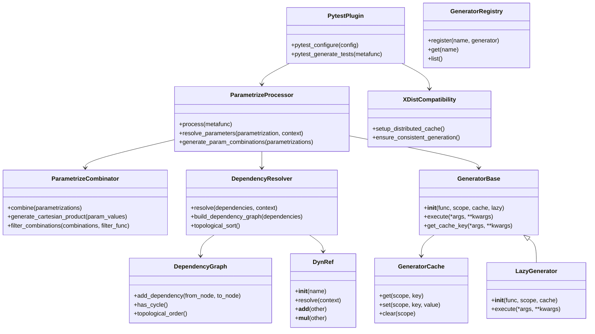
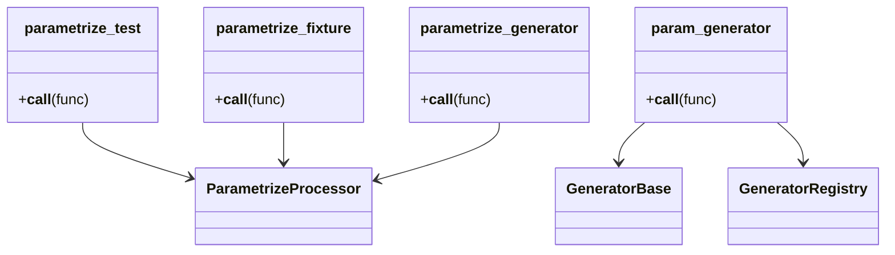
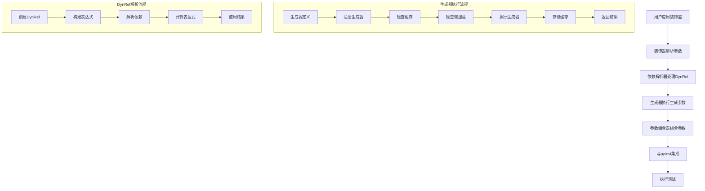

# pytest-dynamic-params 架构设计文档

## 1. 架构概述

pytest-dynamic-params 是一个为 pytest 提供动态参数生成和参数化能力的插件，旨在解决 `pytest.mark.parametrize` 的局限性，让测试参数化更灵活、更强大。

### 1.1 架构目标

- **模块化设计**：将核心功能分离到不同的模块，便于维护和扩展
- **清晰的命名**：模块和文件命名清晰，功能明确
- **与 pytest 原生集成**：与 pytest 官方功能完全兼容，无缝集成
- **性能优化**：通过缓存和懒加载机制提高性能
- **可扩展性**：提供清晰的 API 和扩展点，便于未来功能扩展
- **可测试性**：设计便于测试的架构
- **可维护性**：代码结构清晰，易于理解和维护
- **插件兼容性**：与 pytest 常用插件兼容，特别是 pytest-xdist

### 1.2 技术栈

- **Python 3.7+**：支持现代 Python 语法和特性
- **pytest 7.0+**：与最新版本的 pytest 兼容
- **装饰器模式**：使用装饰器实现参数化和生成器功能
- **依赖注入**：实现参数间的依赖关系
- **插件架构**：采用插件式设计，便于扩展
- **缓存机制**：实现多级缓存策略
- **懒加载**：实现按需加载机制

## 2. 核心组件

### 2.1 模块结构

```
pytest-dynamic-params/
├── src/
│   └── dynamic_params/
│       ├── __init__.py                # 模块入口，导出主要API
│       ├── __version__.py             # 版本信息
│       ├── config.py                  # 全局配置
│       ├── errors.py                  # 错误定义
│       ├── types.py                   # 类型定义
│       ├── engine/                    # 核心引擎
│       │   ├── __init__.py
│       │   ├── dependency/            # 依赖管理
│       │   │   ├── __init__.py
│       │   │   ├── resolver.py        # 依赖解析器
│       │   │   ├── graph.py           # 依赖图
│       │   │   └── dynref.py          # DynRef 实现
│       │   ├── generator/             # 生成器管理
│       │   │   ├── __init__.py
│       │   │   ├── base.py            # 生成器基类
│       │   │   ├── registry.py        # 生成器注册中心
│       │   │   ├── cache.py           # 生成器缓存
│       │   │   └── lazy.py            # 懒加载实现
│       │   └── parametrize/           # 参数化管理
│       │       ├── __init__.py
│       │       ├── processor.py       # 参数化处理器
│       │       └── combinator.py      # 参数组合器
│       ├── plugin/                    # pytest 插件集成
│       │   ├── __init__.py
│       │   ├── pytest_plugin.py       # 插件入口
│       │   ├── hooks.py               # 钩子函数
│       │   ├── utils.py               # 插件工具
│       │   └── compatibility/         # 兼容性处理
│       │       ├── __init__.py
│       │       └── xdist.py           # xdist 兼容性
│       ├── public/                    # 公共 API
│       │   ├── __init__.py
│       │   ├── decorators/            # 装饰器
│       │   │   ├── __init__.py
│       │   │   ├── parametrize_test.py      # 测试函数参数化装饰器
│       │   │   ├── parametrize_fixture.py   # fixture 参数化装饰器
│       │   │   ├── parametrize_generator.py # 生成器参数化装饰器
│       │   │   └── param_generator.py       # 参数生成器装饰器
│       │   └── api.py                 # 公共 API 函数
│       └── utils/                     # 工具函数
│           ├── __init__.py
│           ├── cache.py               # 缓存工具
│           ├── decorators.py          # 装饰器工具
│           └── validation.py          # 验证工具
└── tests/                             # 测试代码
    ├── conftest.py
    ├── unit/                          # 单元测试
    ├── integration/                   # 集成测试
    ├── functional/                    # 功能测试
    ├── performance/                   # 性能测试
    └── compatibility/                 # 兼容性测试
        └── test_xdist.py              # xdist 兼容性测试
```

### 2.2 核心组件说明

| 组件     | 职责          | 文件                    | 说明                     |
| ------ | ----------- | --------------------- | ---------------------- |
| 核心引擎   | 提供核心功能支持    | engine/               | 包含依赖管理、生成器管理和参数化管理     |
| 依赖管理   | 处理参数间的依赖关系  | engine/dependency/    | 包含依赖解析器、依赖图和 DynRef 实现 |
| 生成器管理  | 管理参数生成器     | engine/generator/     | 包含生成器基类、注册中心、缓存和懒加载    |
| 参数化管理  | 处理参数化逻辑     | engine/parametrize/   | 包含参数化处理器和参数组合器         |
| 插件集成   | 与 pytest 集成 | plugin/               | 包含插件入口、钩子函数和工具         |
| 兼容性处理  | 处理与其他插件的兼容  | plugin/compatibility/ | 包含 xdist 等插件的兼容性处理     |
| 公共 API | 提供用户接口      | public/               | 包含装饰器和公共 API 函数        |
| 工具模块   | 提供辅助功能      | utils/                | 提供缓存、装饰器和验证工具          |
| 错误处理   | 定义错误类型      | errors.py             | 定义插件使用的错误类型            |
| 类型定义   | 定义类型注解      | types.py              | 定义插件使用的类型注解            |
| 配置管理   | 管理全局配置      | config.py             | 管理插件的全局配置              |

## 3. 模块设计

### 3.1 核心引擎 (engine/)

#### 3.1.1 依赖管理 (dependency/)

##### 3.1.1.1 依赖解析器 (resolver.py)

- **功能**：解析参数间的依赖关系
- **实现**：
  - 构建依赖图
  - 解析 DynRef 引用
  - 处理依赖循环
  - 优化依赖解析顺序

##### 3.1.1.2 依赖图 (graph.py)

- **功能**：管理依赖关系的图形表示
- **实现**：
  - 构建有向无环图 (DAG)
  - 检测循环依赖
  - 拓扑排序
  - 依赖关系查询

##### 3.1.1.3 DynRef 实现 (dynref.py)

- **功能**：实现参数引用功能
- **实现**：
  - 定义 DynRef 类
  - 支持复杂表达式
  - 运算符重载
  - 依赖解析

#### 3.1.2 生成器管理 (generator/)

##### 3.1.2.1 生成器基类 (base.py)

- **功能**：定义生成器的基本接口
- **实现**：
  - 提供生成器的基本方法
  - 处理生成器的执行
  - 支持参数传递

##### 3.1.2.2 生成器注册中心 (registry.py)

- **功能**：管理生成器的注册和查询
- **实现**：
  - 注册生成器
  - 管理生成器元数据
  - 提供生成器查询接口
  - 支持生成器别名

##### 3.1.2.3 生成器缓存 (cache.py)

- **功能**：实现生成器的缓存机制
- **实现**：
  - 多级缓存策略
  - 缓存键生成
  - 缓存失效处理
  - 不同作用域的缓存管理

##### 3.1.2.4 懒加载实现 (lazy.py)

- **功能**：实现生成器的懒加载
- **实现**：
  - 延迟生成器的执行
  - 懒加载缓存
  - 按需执行机制

#### 3.1.3 参数化管理 (parametrize/)

##### 3.1.3.1 参数化处理器 (processor.py)

- **功能**：处理参数化逻辑
- **实现**：
  - 解析参数化装饰器
  - 处理参数值生成
  - 与 pytest 的参数化机制集成
  - 支持多种参数来源

##### 3.1.3.2 参数组合器 (combinator.py)

- **功能**：组合多个参数化装饰器的参数
- **实现**：
  - 生成参数组合
  - 处理参数笛卡尔积
  - 支持参数过滤

### 3.2 插件集成 (plugin/)

#### 3.2.1 插件入口 (pytest\_plugin.py)

- **功能**：作为 pytest 插件的入口点
- **实现**：
  - 注册 pytest 插件
  - 初始化插件配置
  - 协调各个组件

#### 3.2.2 钩子函数 (hooks.py)

- **功能**：处理 pytest 钩子函数
- **实现**：
  - 实现 pytest\_generate\_tests 钩子
  - 处理其他相关钩子
  - 与 pytest 原生功能集成

#### 3.2.3 插件工具 (utils.py)

- **功能**：提供插件相关的工具函数
- **实现**：
  - pytest 相关工具
  - 插件配置工具
  - 错误处理工具

#### 3.2.4 兼容性处理 (compatibility/)

##### 3.2.4.1 xdist 兼容性 (xdist.py)

- **功能**：处理与 pytest-xdist 的兼容性
- **实现**：
  - 支持并行测试环境
  - 处理分布式缓存
  - 确保参数生成的一致性

### 3.3 公共 API (public/)

#### 3.3.1 装饰器 (decorators/)

##### 3.3.1.1 测试函数参数化装饰器 (parametrize\_test.py)

- **功能**：提供测试函数参数化装饰器
- **实现**：
  - 定义 `@parametrize_test` 装饰器
  - 处理参数名称和值
  - 支持 DynRef 引用
  - 与 pytest 的参数化机制兼容

##### 3.3.1.2 fixture 参数化装饰器 (parametrize\_fixture.py)

- **功能**：提供 fixture 参数化装饰器
- **实现**：
  - 定义 `@parametrize_fixture` 装饰器
  - 处理参数名称和值
  - 支持 DynRef 引用
  - 与 pytest 的 fixture 机制集成

##### 3.3.1.3 生成器参数化装饰器 (parametrize\_generator.py)

- **功能**：提供生成器参数化装饰器
- **实现**：
  - 定义 `@parametrize_generator` 装饰器
  - 处理参数名称和值
  - 支持 DynRef 引用
  - 与生成器函数集成

##### 3.3.1.4 参数生成器装饰器 (param\_generator.py)

- **功能**：提供参数生成器装饰器
- **实现**：
  - 定义 `@param_generator` 装饰器
  - 支持缓存和懒加载配置
  - 注册生成器到注册中心
  - 支持生成器作用域

#### 3.3.2 公共 API 函数 (api.py)

- **功能**：提供公共 API 函数
- **实现**：
  - 导出核心功能
  - 提供便捷函数
  - 支持高级功能

### 3.4 工具模块 (utils/)

#### 3.4.1 缓存工具 (cache.py)

- **功能**：提供缓存相关的工具函数
- **实现**：
  - 缓存键生成
  - 缓存管理
  - 缓存策略

#### 3.4.2 装饰器工具 (decorators.py)

- **功能**：提供装饰器相关的工具函数
- **实现**：
  - 装饰器工厂
  - 装饰器参数处理
  - 装饰器组合

#### 3.4.3 验证工具 (validation.py)

- **功能**：提供验证相关的工具函数
- **实现**：
  - 参数验证
  - 类型检查
  - 配置验证

### 3.5 配置管理 (config.py)

- **功能**：管理插件的全局配置
- **实现**：
  - 加载和解析配置
  - 提供配置访问接口
  - 支持默认配置和用户自定义配置
  - 配置验证

### 3.6 错误处理 (errors.py)

- **功能**：定义插件使用的错误类型
- **实现**：
  - 自定义错误类
  - 错误处理机制
  - 错误消息格式化

### 3.7 类型定义 (types.py)

- **功能**：定义插件使用的类型注解
- **实现**：
  - 类型别名
  - 泛型类型
  - 类型提示

## 4. 生成器同步机制

### 4.1 设计目标

在 pytest-xdist 并行测试环境中，确保生成器数据在多个 Worker 进程间正确同步，同时：
- ✅ 装饰器零参数改动（约定优于配置）
- ✅ 自动预加载静态数据
- ✅ 支持外部资源（数据库、网络）
- ✅ 最小化性能开销

### 4.2 核心策略

**策略：大数据走文件，小配置走钩子**

```
主进程                          Worker 进程
  │                                 │
  ├── 文件同步 ───────────────────> │
  │   - 预加载数据（大数据）        │
  │   - 生成器元数据                │
  │                                 │
  ├── pytest 钩子 ────────────────> │
  │   - Worker 配置                 │
  │   - 同步状态                    │
  │                                 │
```

### 4.3 自动预加载规则

| 作用域 | 预加载策略 | 说明 |
|--------|-----------|------|
| `session` | ✅ 自动预加载 | 主进程执行一次，同步到所有 Worker |
| `module` | ✅ 自动预加载 | 每个 module 执行一次，同步到 Worker |
| `function` | ❌ 不预加载 | 每个 Worker 独立执行 |

**示例**：
```python
# Session 级别 - 自动预加载
@param_generator(scope='session', cache=True)
def generate_users():
    # 主进程执行，数据同步到 Worker
    return [{'id': 1, 'username': 'alice'}]

# Function 级别 - Worker 独立执行
@param_generator(scope='function')
def generate_realtime():
    # 每个 Worker 独立查询
    yield from get_realtime_data()
```

### 4.4 核心组件

#### 4.4.1 SyncManager（同步管理器）

**职责**：
- 注册和管理生成器
- 预加载数据到文件
- 通过 pytest 钩子传递配置
- 清理临时文件

**工作流程**：
```
主进程：
1. 注册生成器 → SyncManager
2. 执行预加载 → 写入同步文件
3. pytest_configure_node → 传递配置

Worker 进程：
1. pytest_configure → 接收配置
2. 读取同步文件 → 加载预加载数据
3. 设置生成器 → 使用预加载数据
```

#### 4.4.2 WorkerPool（Worker 连接池）

**职责**：
- 为每个 Worker 提供独立连接
- 自动管理连接生命周期
- 避免连接跨 Worker 共享

**使用示例**：
```python
from dynamic_params.engine.generator.worker_pool import WorkerPool

@param_generator(scope='function')
def generate_orders():
    with WorkerPool.get_connection('orders_db', create_conn_func) as conn:
        # 每个 Worker 独立的 orders_db 连接
        yield from query_orders(conn)
```

### 4.5 外部资源处理

**策略：主进程预加载 + Worker 独立连接**

| 资源类型 | 处理方式 | 说明 |
|---------|---------|------|
| 数据库（静态数据） | 主进程预加载 | 查询一次，同步到所有 Worker |
| 数据库（实时数据） | Worker 独立连接 | 每个 Worker 独立查询 |
| 网络 API | 主进程预加载 | API 调用一次，同步到 Worker |
| 文件系统 | 主进程预加载 | 读取一次，同步到 Worker |

### 4.6 数据流

```python
# 主进程流程
1. pytest_configure → 初始化 SyncManager
2. 注册生成器 → 检测 scope
3. scope=session/module → 执行预加载
4. 写入同步文件 → 原子写入
5. pytest_configure_node → 传递配置到 Worker

# Worker 进程流程
1. pytest_configure → 接收配置
2. 读取同步文件 → 加载预加载数据
3. 设置生成器 → 使用预加载数据
4. 测试执行 → 使用预加载数据
5. pytest_unconfigure → 清理资源
```

---

## 5. 数据流

### 5.1 参数化流程

1. **装饰器应用**：用户使用 `@parametrize_test` 装饰器标记测试函数或 `@parametrize_fixture` 装饰器标记 fixture
2. **参数解析**：装饰器解析参数名称和值，注册参数化配置
3. **依赖处理**：`dependency/resolver.py` 处理 DynRef 引用和其他依赖关系
4. **生成器执行**：如果使用了生成器，`generator/base.py` 执行生成器函数生成参数
5. **参数组合**：`parametrize/combinator.py` 组合多个参数化装饰器的参数
6. **与 pytest 集成**：`plugin/hooks.py` 将处理后的参数传递给 pytest 的参数化机制
7. **测试执行**：pytest 执行测试函数，使用生成的参数

### 4.2 生成器执行流程

1. **生成器定义**：用户使用 `@param_generator` 装饰器定义生成器函数
2. **注册生成器**：生成器被注册到 `generator/registry.py` 中的注册中心
3. **缓存检查**：`generator/cache.py` 检查是否启用了缓存，如果启用且缓存命中，直接返回缓存值
4. **懒加载检查**：`generator/lazy.py` 检查是否启用了懒加载，如果启用，延迟执行
5. **生成器执行**：执行生成器函数，生成参数值
6. **缓存存储**：如果启用了缓存，将生成的参数值存储到缓存中
7. **返回结果**：返回生成的参数值

### 4.3 DynRef 解析流程

1. **DynRef 创建**：用户创建 DynRef 实例，指定要引用的参数名称
2. **表达式构建**：用户可以使用 DynRef 构建复杂表达式
3. **依赖解析**：`dependency/resolver.py` 在参数化过程中，解析 DynRef 引用的参数值
4. **表达式计算**：计算完整表达式的值
5. **结果使用**：将计算结果作为参数值使用

## 5. 关键类和函数

### 5.1 依赖管理类和函数

#### 5.1.1 DependencyResolver

```python
class DependencyResolver:
    """解析参数间的依赖关系"""
    
    def __init__(self):
        """初始化依赖解析器"""
        # 初始化依赖图
    
    def resolve(self, dependencies, context):
        """解析依赖"""
        # 解析依赖逻辑
    
    def build_dependency_graph(self, dependencies):
        """构建依赖图"""
        # 构建依赖图逻辑
    
    def topological_sort(self):
        """拓扑排序"""
        # 拓扑排序逻辑
```

#### 5.1.2 DependencyGraph

```python
class DependencyGraph:
    """管理依赖关系的图形表示"""
    
    def __init__(self):
        """初始化依赖图"""
        # 初始化图结构
    
    def add_dependency(self, from_node, to_node):
        """添加依赖关系"""
        # 添加依赖逻辑
    
    def has_cycle(self):
        """检测循环依赖"""
        # 检测循环依赖逻辑
    
    def topological_order(self):
        """获取拓扑排序"""
        # 拓扑排序逻辑
```

#### 5.1.3 DynRef

```python
class DynRef:
    """在参数化中引用其他参数"""
    
    def __init__(self, name):
        """初始化 DynRef 实例"""
        # 初始化逻辑
    
    def resolve(self, context):
        """解析引用的参数值"""
        # 解析逻辑
    
    # 运算符重载方法
    def __add__(self, other):
        # 实现加法运算
    
    def __mul__(self, other):
        # 实现乘法运算
    
    # 其他运算符重载方法
```

### 5.2 生成器管理类和函数

#### 5.2.1 GeneratorBase

```python
class GeneratorBase:
    """生成器基类"""
    
    def __init__(self, func, scope="function", cache=False, lazy=False):
        """初始化生成器"""
        # 初始化逻辑
    
    def execute(self, *args, **kwargs):
        """执行生成器"""
        # 执行逻辑
    
    def get_cache_key(self, *args, **kwargs):
        """获取缓存键"""
        # 获取缓存键逻辑
```

#### 5.2.2 GeneratorRegistry

```python
class GeneratorRegistry:
    """管理生成器的注册和查询"""
    
    def __init__(self):
        """初始化注册中心"""
        # 初始化注册表
    
    def register(self, name, generator):
        """注册生成器"""
        # 注册生成器逻辑
    
    def get(self, name):
        """获取生成器"""
        # 获取生成器逻辑
    
    def list(self):
        """列出所有生成器"""
        # 列出生成器逻辑
```

#### 5.2.3 GeneratorCache

```python
class GeneratorCache:
    """实现生成器的缓存机制"""
    
    def __init__(self):
        """初始化缓存"""
        # 初始化缓存
    
    def get(self, scope, key):
        """获取缓存值"""
        # 获取缓存逻辑
    
    def set(self, scope, key, value):
        """设置缓存值"""
        # 设置缓存逻辑
    
    def clear(self, scope=None):
        """清理缓存"""
        # 清理缓存逻辑
```

#### 5.2.4 LazyGenerator

```python
class LazyGenerator(GeneratorBase):
    """懒加载生成器"""
    
    def __init__(self, func, scope="function", cache=False):
        """初始化懒加载生成器"""
        # 初始化逻辑
    
    def execute(self, *args, **kwargs):
        """执行生成器"""
        # 懒加载执行逻辑
```

### 5.3 参数化管理类和函数

#### 5.3.1 ParametrizeProcessor

```python
class ParametrizeProcessor:
    """处理参数化逻辑"""
    
    def process(self, metafunc):
        """处理参数化"""
        # 处理参数化逻辑
    
    def resolve_parameters(self, parametrization, context):
        """解析参数"""
        # 解析参数逻辑
    
    def generate_param_combinations(self, parametrizations):
        """生成参数组合"""
        # 生成参数组合逻辑
```

#### 5.3.2 ParametrizeCombinator

```python
class ParametrizeCombinator:
    """组合多个参数化装饰器的参数"""
    
    def combine(self, parametrizations):
        """组合参数"""
        # 组合参数逻辑
    
    def generate_cartesian_product(self, param_values):
        """生成参数笛卡尔积"""
        # 生成笛卡尔积逻辑
    
    def filter_combinations(self, combinations, filter_func):
        """过滤参数组合"""
        # 过滤参数组合逻辑
```

### 5.4 插件集成类和函数

#### 5.4.1 PytestPlugin

```python
class PytestPlugin:
    """pytest 插件类"""
    
    def __init__(self):
        """初始化插件"""
        # 初始化逻辑
    
    def pytest_configure(self, config):
        """配置插件"""
        # 配置逻辑
    
    def pytest_generate_tests(self, metafunc):
        """生成测试参数"""
        # 生成测试参数逻辑
```

### 5.5 公共 API 函数

#### 5.5.1 parametrize\_test

```python
def parametrize_test(argnames, argvalues, **kwargs):
    """测试函数参数化装饰器"""
    # 实现参数化逻辑
```

#### 5.5.2 parametrize\_fixture

```python
def parametrize_fixture(argnames, argvalues, **kwargs):
    """fixture 参数化装饰器"""
    # 实现参数化逻辑
```

#### 5.5.3 parametrize\_generator

```python
def parametrize_generator(argnames, argvalues, **kwargs):
    """生成器参数化装饰器"""
    # 实现参数化逻辑
```

#### 5.5.4 param\_generator

```python
def param_generator(func=None, *, scope="function", cache=False, lazy=False):
    """定义参数生成器函数"""
    # 实现生成器包装逻辑
```

### 5.6 兼容性处理类和函数

#### 5.6.1 XDistCompatibility

```python
class XDistCompatibility:
    """处理与 pytest-xdist 的兼容性"""
    
    def __init__(self):
        """初始化兼容性处理"""
        # 初始化逻辑
    
    def setup_distributed_cache(self):
        """设置分布式缓存"""
        # 设置分布式缓存逻辑
    
    def ensure_consistent_generation(self):
        """确保参数生成的一致性"""
        # 确保一致性逻辑
```

## 6. UML 图

### 6.1 核心类关系图



### 6.2 装饰器关系图



### 6.3 数据流图



## 7. 与 pytest 的集成

### 7.1 插件注册

```python
def pytest_configure(config):
    """注册插件"""
    # 注册插件逻辑
    config.pluginmanager.register(PytestPlugin(), "dynamic_params")
```

### 7.2 钩子函数

```python
def pytest_generate_tests(metafunc):
    """生成测试参数"""
    # 生成测试参数逻辑
    processor = ParametrizeProcessor()
    processor.process(metafunc)
```

### 7.3 与原生参数化的兼容性

- **混合使用**：支持与 `pytest.mark.parametrize` 混合使用
- **优先级**：当同时使用时，插件的参数化逻辑会与 pytest 原生逻辑协同工作
- **行为一致性**：保持与 pytest 原生参数化相同的行为和输出

### 7.4 与 pytest-xdist 的兼容性

- **并行测试支持**：确保在并行测试环境中参数生成的一致性
- **分布式缓存**：处理分布式环境下的缓存同步
- **性能优化**：在并行环境中优化参数生成和依赖解析

## 8. 扩展点

### 8.1 自定义生成器

- **扩展方式**：用户可以通过继承 `GeneratorBase` 类来实现自定义生成器
- **示例**：
  ```python
  class CustomGenerator(GeneratorBase):
      def execute(self, *args, **kwargs):
          # 自定义生成逻辑
          return [1, 2, 3]
  ```

### 8.2 自定义依赖解析器

- **扩展方式**：用户可以通过继承 `DependencyResolver` 类来扩展依赖解析逻辑
- **示例**：
  ```python
  class CustomDependencyResolver(DependencyResolver):
      def resolve(self, dependencies, context):
          # 自定义解析逻辑
          return super().resolve(dependencies, context)
  ```

### 8.3 自定义缓存策略

- **扩展方式**：用户可以通过实现 `GeneratorCache` 接口来扩展缓存策略
- **示例**：
  ```python
  class CustomCache(GeneratorCache):
      def get(self, scope, key):
          # 自定义获取逻辑
          pass
      
      def set(self, scope, key, value):
          # 自定义设置逻辑
          pass
  ```

### 8.4 自定义参数组合器

- **扩展方式**：用户可以通过继承 `ParametrizeCombinator` 类来扩展参数组合逻辑
- **示例**：
  ```python
  class CustomCombinator(ParametrizeCombinator):
      def combine(self, parametrizations):
          # 自定义组合逻辑
          return super().combine(parametrizations)
  ```

### 8.5 插件扩展

- **扩展方式**：用户可以通过实现 pytest 插件来扩展功能
- **示例**：
  ```python
  def pytest_configure(config):
      # 扩展插件配置
      pass
  ```

## 9. 性能优化

### 9.1 缓存机制

- **多级缓存**：实现不同作用域的缓存（function、class、module、session）
- **智能缓存键**：使用函数签名和参数作为缓存键，确保缓存的准确性
- **缓存失效**：在适当的时机清理缓存，避免内存泄漏
- **缓存统计**：提供缓存命中率统计，便于性能分析

### 9.2 懒加载机制

- **按需执行**：生成器只有在需要时才会执行，减少不必要的计算
- **懒加载缓存**：结合缓存机制，进一步提高性能
- **并行执行**：对于独立的生成器，可以并行执行，提高效率

### 9.3 依赖解析优化

- **依赖图缓存**：缓存依赖图，避免重复构建
- **拓扑排序**：使用拓扑排序优化依赖解析顺序，提高解析效率
- **依赖预解析**：对于频繁使用的依赖，可以预解析，减少运行时开销

### 9.4 并行测试优化

- **分布式缓存**：在 pytest-xdist 环境中实现分布式缓存
- **一致性保证**：确保在并行环境中参数生成的一致性
- **负载均衡**：优化参数分配，实现负载均衡

### 9.5 其他优化策略

- **预计算**：对于频繁使用的参数值进行预计算
- **内存管理**：合理管理内存使用，避免内存溢出
- **代码优化**：优化关键路径的代码，提高执行效率
- **并行处理**：对于独立的任务，使用并行处理提高性能

## 10. 测试策略

### 10.1 单元测试

- **测试目标**：测试各个模块的功能
- **测试方法**：使用 pytest 进行单元测试
- **测试覆盖**：确保代码覆盖率达到 95% 以上
- **测试目录**：`tests/unit/`
- **测试重点**：核心功能、边界情况、错误处理

### 10.2 集成测试

- **测试目标**：测试插件与 pytest 的集成
- **测试方法**：使用 pytest 进行集成测试
- **测试场景**：测试各种参数化场景，包括基本参数化、fixture 参数化、生成器参数化等
- **测试目录**：`tests/integration/`
- **测试重点**：与 pytest 的兼容性、插件间的交互

### 10.3 功能测试

- **测试目标**：测试插件的功能完整性
- **测试方法**：使用 pytest 进行功能测试
- **测试场景**：测试各种功能场景，包括缓存、懒加载、依赖解析等
- **测试目录**：`tests/functional/`
- **测试重点**：功能正确性、性能表现

### 10.4 性能测试

- **测试目标**：测试插件的性能
- **测试方法**：使用性能测试工具进行测试
- **测试指标**：执行时间、内存使用、缓存命中率等
- **测试目录**：`tests/performance/`
- **测试重点**：性能瓶颈、优化效果

### 10.5 兼容性测试

- **测试目标**：测试插件与其他 pytest 插件的兼容性
- **测试方法**：使用 pytest 进行兼容性测试
- **测试场景**：测试与 pytest-xdist 等插件的兼容性
- **测试目录**：`tests/compatibility/`
- **测试重点**：插件间的交互、并行测试支持

### 10.6 回归测试

- **测试目标**：确保修改不会破坏现有功能
- **测试方法**：定期运行完整的测试套件
- **测试重点**：现有功能的稳定性

## 11. 部署与发布

### 11.1 安装方式

- **PyPI 安装**：`pip install pytest-dynamic-params`
- **源码安装**：`pip install -e .`
- **版本锁定**：支持通过 `requirements.txt` 锁定版本

### 11.2 版本管理

- **版本号格式**：遵循语义化版本规范（MAJOR.MINOR.PATCH）
- **发布流程**：
  1. 执行测试确保通过
  2. 更新版本号
  3. 构建发布包
  4. 上传到 PyPI
  5. 发布版本到 GitHub

### 11.3 依赖管理

- **核心依赖**：pytest 7.0+
- **开发依赖**：pytest-cov、flake8、isort、black、mypy、pre-commit 等
- **依赖锁定**：使用 `requirements.txt` 和 `setup.py` 管理依赖

### 11.4 CI/CD 流程

- **代码质量**：使用 pre-commit 钩子进行代码检查
- **测试**：推送代码时自动运行测试，包括兼容性测试
- **构建**：发布新版本时自动构建
- **部署**：自动上传到 PyPI

## 12. 结论

pytest-dynamic-params 插件通过模块化设计和与 pytest 的无缝集成，提供了强大的动态参数生成和参数化能力。架构设计考虑了性能优化、可扩展性和与 pytest 原生功能的兼容性，确保插件能够满足各种测试场景的需求。

通过本架构设计文档的指导，插件的开发和实现将更加清晰和有序，确保最终产品的质量和可用性。插件的设计遵循 pytest 的理念，与原生功能完全兼容，同时提供了丰富的高级特性，如参数依赖、缓存和懒加载等，为 pytest 用户提供了更灵活、更强大的参数化工具。

架构设计的改进点：

1. **更清晰的模块划分**：使用更具描述性的模块名称，如 `engine/dependency/`、`engine/generator/`、`engine/parametrize/` 等
2. **更明确的职责划分**：每个模块有明确的职责，避免功能交叉
3. **更强的扩展性**：提供了多个扩展点，便于用户自定义功能
4. **更全面的性能优化**：实现了多级缓存、懒加载和依赖解析优化等多种性能优化策略
5. **更完整的测试策略**：设计了单元测试、集成测试、功能测试、性能测试和兼容性测试
6. **更专业的项目结构**：参考中大型项目的结构，更符合行业最佳实践
7. **更好的插件兼容性**：特别考虑了与 pytest-xdist 等常用插件的兼容性

这些改进将使插件更加易于维护和扩展，同时提供更好的用户体验。
